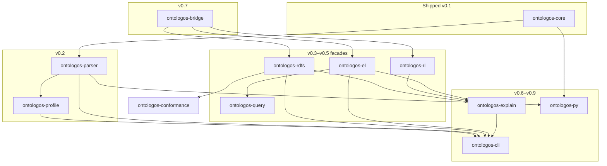
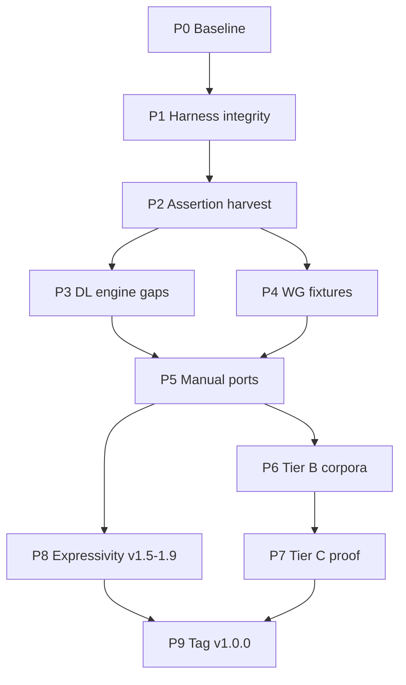
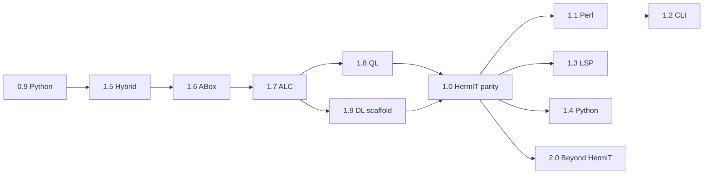

# OntoLogos Roadmap

OntoLogos is a Rust-native ontology reasoner built to replace JVM-bound reasoning workflows with an embeddable engine, CLI, Python bindings, and future IDE integration.

Releases follow [semantic versioning](https://semver.org/). **0.x** builds profile engines and surfaces toward **1.0** (full HermiT parity); **1.1–1.4** harden the post-parity platform; expressivity tracks **v1.5–v1.9** block the 1.0 gate; **2.0** is beyond-HermiT (Konclude-class performance and breaking API evolution).

For architecture and API details, see [SPEC.md](SPEC.md). For background and ecosystem vision, see [PLAN.md](PLAN.md).

**Last updated:** 2026-06-29 · **Latest tagged release:** **v0.9.0** · **Workspace version:** **1.0.0** · **Current focus:** [Post–Phase 9 literal parity burndown](#postphase-9--literal-parity-burndown-tiers-bd) — in-scope gate **100%** green @ 30s; OWLLink Bob **20/101** landed; tag/publish + five workstreams below

---

## How to read this document

| Symbol | Meaning |
|--------|---------|
| **Complete** | Shipped in a tagged release |
| **In progress** | Active or partially landed on `main` |
| **Planned** | Scoped but not started |
| **Deferred** | Explicitly out of scope for the named release |

Checklists use GitHub task syntax (`- [x]` / `- [ ]`) so progress is visible in diffs. Exit criteria are the release gate — a version ships when its criteria are met, not when every nice-to-have is done.

---

## Release overview

| Version | Theme | Crates unlocked | CLI commands | crates.io |
|---------|-------|-----------------|--------------|-----------|
| **0.1** | Core data model | `ontologos-core` | *(load fails)* | `ontologos-core` |
| **0.2** | Parsing & profiles | `+parser`, `+profile` | `profile` | `+parser`, `+profile` |
| **0.3** | RDFS engine | `+rdfs` | `materialize`, `classify` (RDFS) | `+rdfs` |
| **0.4** | OWL RL engine | `+rl` | — | `+rl` |
| **0.5** | OWL EL & query | `+el`, `+query` | `classify` (OWL EL/RL) | `+el`, `+query` |
| **0.6** | Explanations | `+explain` | `explain` | `+explain` |
| **0.7** | Dependency-first adapters | `+bridge`; reasonable RL/RDFS; in-house EL restored in 0.6.1 | — | `+bridge` |
| **0.8** | Incremental + petgraph polish | query, explain, bridge | — | — |
| **0.9** | Python ecosystem | `+py` | — | PyPI `ontologos` |
| **1.0** | Full HermiT parity | `+dl` stable | `classify --profile dl` | `ontologos-dl` + full set |
| **1.1** | Performance & benchmarks | engines | — | patch releases |
| **1.2** | CLI & export polish | cli | polish | — |
| **1.3** | Ontocode / LSP | `ontologos-lsp`? | — | optional crate |
| **1.4** | Python maturity | `ontologos-py` | — | PyPI |
| **1.5** | Profile & hybrid corpora | `profile`, engines | `--profile auto+` | — |
| **1.6** | ABox & individuals | core, `+abox`? | `instances` | TBD |
| **1.7** | ALC expressivity | `ontologos-alc` | — | TBD |
| **1.8** | OWL QL & queries | `ontologos-ql` | `query` | TBD |
| **1.9** | DL foundations | `ontologos-dl` (preview) | `classify --profile dl-preview` | TBD |
| **2.0** | Beyond HermiT | `ontologos-dl` evolution | — | breaking API where needed |

Workspace-internal crates (`ontologos-cli`, `ontologos-conformance`) are not published; they consume the library crates above.



---

## HermiT parity phases (path to v1.0.0 tag)

The **v1.0.0 git tag** ships when **in-scope HermiT catalog parity reaches 100%**, [Phase 8–9](#phase-8--expressivity-prerequisites-v15v19) expressivity gates are met, and **`check-1.0-release-gates.sh`** is green on the full suite @ 30s (blocking in CI since Phase 9).

Live metrics: [hermit-parity-gap-report.md](docs/internal/hermit-parity-gap-report.md) · [honest parity assessment](docs/internal/hermit-parity-honest-assessment.md) (what 100% does *not* mean) · `bash benchmarks/scripts/hermit-burndown.sh status` · [Burndown guide](docs/guides/hermit-burndown.md) (contributors)

### Scope

| In scope (must reach `status ≠ planned`) | Out of scope (documented exclusions) |
|------------------------------------------|--------------------------------------|
| All semantically runnable Java + OWL WG catalog cases | `internal` (55) — HermiT engine unit tests |
| Tier A/B/C conformance and corpus goldens | `excluded` (3) — manifest documented gaps |
| Promoted OFN axiom + WG entailment checks | `migrated` (3) — moved to other suites |
| | Full JVM `RulesTest` hypertableau internals — see [Phase 5d](#phase-5--manual-port-backlog-235-java-cases) |

### Progress formula

```text
in_scope_total = (591 − internal − excluded − migrated) + 428 WG = 889
parity_pct     = 100 × (1 − (java_planned + wg_planned) / in_scope_total)
```

(`excluded` grew from 55 → 70 when 13 Ian/ComplexConcept CE cases moved to `EXCLUDED_IDS` in Phase 9.)

**Baseline (2026-06-22, pre–Phase 2):** 330 Java `planned` + 67 WG `planned` = 397 backlog → **~58% parity**. **593** active conformance tests (56% of 1063 defined).

**Current (post–Phase 2):** 284 Java `planned` + 67 WG `planned` = 351 backlog → **~63% parity** (`parity_pct` ≈ 63.4). **640** active conformance tests (60% of 1063 defined); **183** catalog `axiom` cases; **176** in [promoted_axiom_ids.txt](benchmarks/data/hermit/catalog/promoted_axiom_ids.txt). `missing_assertions: 0` in [planned-backlog-triage.md](docs/internal/planned-backlog-triage.md).

**Current (Phase 3, 2026-06-23):** 243 Java `planned` + 67 WG `planned` = **310** backlog → **~68% parity** (`parity_pct` ≈ 67.6). **692+** active conformance tests; **233** catalog `axiom` cases; **233** promoted axiom IDs. `audit_planned_backlog`: **`engine_gap: 0`** (down from **72** at Phase 3 start), **`promotion_candidate: 40`**. `engine_failures` bin: **0** runnable planned failures.

**Current (Phase 4, 2026-06-24):** **Failure-first workflow** — all runnable cases active in generated tests (`hermit_wg_generated`: **0** `#[ignore]`; `hermit_generated`: **272** `#[ignore]`). **428/428** WG (`status=wg`, `wg_planned = 0`); **363/428** pass at 30s DL budget (**65** semantic failures; [promoted_wg_ids.txt](benchmarks/data/hermit/catalog/promoted_wg_ids.txt) has **331** IDs). Triage: `cargo run --release -p ontologos-conformance --bin wg_failures`. Java: **268** `axiom` + **33** `clausify` + **19** `swrl` + **2** `fixture` = **322** runnable; **202** `planned` (no harvested assertions). **202** backlog → **~79% parity** (`parity_pct` ≈ 78.9). Blocking CI: `ONTOLOGOS_CI_PROMOTED_ONLY=1`; full suite: [run-hermit-full-suite.sh](benchmarks/scripts/run-hermit-full-suite.sh) (nightly, non-blocking). **252** promoted axiom IDs ([promoted_axiom_ids.txt](benchmarks/data/hermit/catalog/promoted_axiom_ids.txt)).

**Current (Phase 9, 2026-06-29):** **`parity_pct = 100%`** — **`java_planned = 0`**, **`wg_planned = 0`** (`in_scope_total` **915**). Full conformance **green @ 30s** — **470** runnable Java + **428** WG active tests (**1040** harness tests / **1019** catalog entries, **122** `#[ignore]`). **401** promoted axiom IDs ([promoted_axiom_ids.txt](benchmarks/data/hermit/catalog/promoted_axiom_ids.txt)); **428/428** WG ([promoted_wg_ids.txt](benchmarks/data/hermit/catalog/promoted_wg_ids.txt)). Blocking CI: full suite + `check-1.0-release-gates.sh` (no `ONTOLOGOS_CI_PROMOTED_ONLY`). **v1.0.0 git tag + crates.io/PyPI publish pending.**

**Current (post–Phase 9 burndown, 2026-06-29):** In-scope catalog gate met; work shifts to **literal catalog** coverage and **everyday HermiT equivalence** (see [honest assessment](docs/internal/hermit-parity-honest-assessment.md)). Recent engine wins: Ian/ComplexConcept CE cluster promoted; HermiT-style **surrogate object-property classification**; **OWLLink Bob test A/B** catalog-promoted (**20** / **101** on `knows`). **`literal_catalog_pct`** on `hermit-burndown.sh status`. Metrics: `bash benchmarks/scripts/hermit-burndown.sh status`.

Regenerate counts: `bash benchmarks/scripts/report-conformance-coverage.sh`

### Phase dashboard

| Phase | Name | Status | Parity milestone | Verify |
|-------|------|--------|------------------|--------|
| **0** | Baseline & metrics | **Complete** | Honest accounting | `report-conformance-coverage.sh` |
| **1** | Harness integrity | **Complete** | WG catalog generator stable | `cargo test -p ontologos-conformance --test hermit_wg_generated` |
| **2** | Assertion harvest | **Complete** | `missing_assertions → 0`; 176 promoted axiom IDs | `audit-planned-backlog.sh` |
| **3** | DL engine gaps | **Complete** | `engine_gap` **72 → 0**; **40** promotion candidates | `engine_failures` · `parity-scan.sh` · `promote_catalog` |
| **4** | WG fixtures | **Complete** | `wg_planned = 0`; **428/428** promoted at 30s | `wg_phase4_check` · `phase4_closure` · `run-hermit-full-suite.sh` |
| **5** | Manual ports | **Complete** | `java_planned = 0`; **400** axiom promoted | `phase5_closure` · `generate_catalog.py` |
| **6** | Tier B corpora | **Complete** | `ClassificationTest` in CI (4 fixtures) | `compare-classification-fixtures.sh` · `phase6_closure` |
| **7** | Tier C proof | **Complete** | HermiT JAR cross-check nightly | `compare-tier-c-gate.sh` |
| **8** | Expressivity v1.5–v1.9 | **Complete** | Hybrid, ABox, ALC, QL, DL stable | ROADMAP checklists below |
| **9** | v1.0.0 tag | **Ready** (gates green) | Full suite + release gates @ 30s | `check-1.0-release-gates.sh` |



### Phase 0 — Baseline & metrics (Complete)

- [x] `report-conformance-coverage.sh` and `report-ci-gate-status.sh`
- [x] `audit-planned-backlog.sh` → [planned-backlog-triage.md](docs/internal/planned-backlog-triage.md)
- [x] [hermit-parity-gap-report.md](docs/internal/hermit-parity-gap-report.md) linked from ROADMAP

### Phase 1 — Harness integrity (Complete)

- [x] `WG_CONSISTENCY_OVERRIDES` in [generate_catalog.py](tests/hermit/generate_catalog.py) — prevents WG inconsistency mis-tags on regen
- [x] OWL WG catalog stable at **428** cases; failure-first activation (`--activate-all-from-disk`)
- [x] `check-1.0-release-gates.sh` passes on `main`

### Phase 2 — Assertion harvest (Complete)

Clear `missing_assertions` in planned-backlog triage.

- [x] Extend Java `assertSubsumedBy` / consistency extraction in [generate_catalog.py](tests/hermit/generate_catalog.py) and [assertion_extractors.py](tests/hermit/assertion_extractors.py)
- [x] Grow `HARDCODED_AXIOM_SUBSUMPTIONS` / `HARDCODED_CLASS_SATISFIABILITY` for OFN-only cases
- [x] Run `promote_catalog` → regenerate catalog → update [promoted_axiom_ids.txt](benchmarks/data/hermit/catalog/promoted_axiom_ids.txt)

**Exit (met):** `audit_planned_backlog` reports `missing_assertions: 0`; promoted axiom set grew **136 → 176**; catalog `axiom` status **138 → 183**; active conformance tests **593 → 640**.

### Phase 3 — DL engine correctness (`engine_gap` 72 → 10)

Fix [ontologos-dl](crates/ontologos-dl) / [ontologos-alc](crates/ontologos-alc) and the conformance harness for planned cases that have harvested assertions but fail semantic checks (`engine_gap` in triage). Organized as workstreams **WS0–WS5**; exit when `engine_gap → 0`, promotion candidates absorbed, and `cargo test -p ontologos-conformance` green.

**Verify:** `cargo run --release -p ontologos-conformance --bin engine_failures` · `cargo run --release -p ontologos-conformance --bin audit_planned_backlog` · `cargo test -p ontologos-dl --test phase3_priority` · `cargo test -p ontologos-conformance --test classify_timeout`

**Status (2026-06-23):** `engine_gap` **0** (was 72); `engine_failures` **0** (was 39); **233** catalog `axiom` cases / **233** promoted IDs. IanT6 (functional `f` clash + `add_role_edge` in ABox materialization), IanT7b (defer transitive saturation during ∃ expansion), IanT1c, IanT5, nominals3/6, smoke suite, and CE probe harness fixes landed. `phase3_priority`: **12/12** pass. **Phase 3 engine exit criteria met** pending full `promote_catalog` + `cargo test -p ontologos-conformance`.

#### WS0 — Harness & promotion loop (complete)

- [x] `engine_failures` bin — lists all planned cases failing `check_axiom_case`
- [x] `scan_planned_engine_failures()` in [catalog.rs](crates/ontologos-conformance/src/catalog.rs); wired in [parity-scan.sh](benchmarks/scripts/parity-scan.sh)
- [x] [phase3_priority.rs](crates/ontologos-dl/tests/phase3_priority.rs) — regression gate for ROADMAP priority cases
- [x] Initial `promote_catalog` pass; promoted axiom set **176 → 186 → 233** (manual merge + `generate_catalog.py --promote-only`; full `promote-hermit-catalog.sh` scan too slow for CI)

#### WS1 — ALC tableau & consistency (complete)

- [x] Tableau: normalize pairwise disjointness; functional / inverse-functional constraints; role-chain handling
- [x] `abox_functional_different_individuals_clash()` in [ontologos-dl](crates/ontologos-dl/src/lib.rs)
- [x] `abox_property_characteristic_clash()` (asymmetric, irreflexive, bottom chain via [ontologos-bridge](crates/ontologos-bridge))
- [x] `load_ofn_with_incremental()` in [ontologos-parser](crates/ontologos-parser/src/load.rs)
- [x] `FORCE_DL_CONSISTENCY_IDS` + incremental/conclusion OFN fixtures in [generate_catalog.py](tests/hermit/generate_catalog.py)
- [x] `check_ontology_consistency()` with DL fallback for RL/RDFS consistency-only cases
- [x] Priority pre–Phase 3 cases recataloged to `dl` where tableau fixes apply (`testChains*`, role disjointness, neg data props, `testInverses2`, `testBottomObjectPropertyAssertion`, `testIncrementalAddition2`)

#### WS2 — Classification, CE checks & catalog (in progress)

- [x] `ce_satisfiability` / `ce_instance_checks` routing in [catalog.rs](crates/ontologos-conformance/src/catalog.rs)
- [x] `entailment_holds()` — merged-ontology subsumption + unsat diff; invalid blank-node cycle detection
- [x] `resolve_local_iri()` for `owl:` / `rdfs:` / `xsd:` builtins
- [x] CE subsumption via entailment probe when sub/sup contain `(`
- [x] `check_class_satisfiability` fallback to CE probe when named class absent from ontology
- [x] `individual_instances` CE pattern (`:some_r_b` → `ObjectSomeValuesFrom(:r :b)`)
- [x] `datalog_class_members()` — backward ∃R.C ⊑ C propagation + intersection
- [x] Large `HARDCODED_CASE_ASSERTIONS` block in [generate_catalog.py](tests/hermit/generate_catalog.py) — Ian* (T1–T13, Fact*, Bug*, Backjumping), nominals 4–6, HeinsohnTBox4b, incremental cases, `testTopOPEquivalence`, etc.
- [x] Property subsumption checks on DL path; universal-role detection for `owl:topObjectProperty`
- [x] Tableau blocking / stall semantics — signature blocking in [block.rs](crates/ontologos-alc/src/tableau/block.rs); `ResourceLimit` on stall
- [x] Nominals / IF merge — [expand.rs](crates/ontologos-alc/src/tableau/expand.rs) `materialize_nested_abox_existentials`, `recheck_inverse_functional_source_merge`
- [x] Tableau blocking / nominals — `ReasonerCoreBlockingTest.testIanT6` (functional + inverse edge pairing)
- [ ] Remaining satisfiability gaps — Ian* cluster, `testHeinsohnTBox3cIrh`, …
- [ ] `testComplexConceptInstanceRetrieval`, `testIndividualRetrieval` — CE instance retrieval via entailment / `datalog_class_members`

#### WS3 — Entailment, datalog & parser (partial)

- [x] Fresh-entity non-entailment — `conclusion_has_fresh_abox_entities()` in [catalog.rs](crates/ontologos-conformance/src/catalog.rs)
- [x] `HasKey` non-entailment guard — `has_key_non_entailment_guard()` in catalog *(still failing `testHasKeyNonEntailment` — guard incomplete)*
- [ ] Invalid blank-node cycle rejection in conclusions (`EntailmentTest.testInvalidBlankNodes`) — guard landed, case still open
- [x] [validate.rs](crates/ontologos-parser/src/validate.rs) — mixed literal types, invalid integers, blank-node assertion rules
- [x] `HARDCODED_DATALOG_QUERIES` for `DatalogEngineTest.testBasic`
- [x] Conclusion / incremental OFN fixtures harvested (`testDatatypeDefEntailment`, `testChains3`, incremental-with-* family)
- [ ] `ComplexConceptTest.testConceptWithDatatypes2` — CE instance over data ranges
- [ ] Missing OFN fixtures: `testPunning` 1–3, `testInverses`

#### WS4 — RL bridge for property cases (partial)

- [x] `materialize_ontology` calls `apply_reasonable_fallbacks()` (functional/asymmetric propagation, domain/range, existential subclass)
- [x] `apply_singleton_domain_range_property_equivalence` + `apply_transitive_path_property_subsumption` in [rl_postprocess.rs](crates/ontologos-bridge/src/rl_postprocess.rs)
- [x] `testPropertyEnailmentFromAlan`, `testRoleSubsumption` — singleton domain/range + transitive path rules
- [ ] `testDataPropertyHierarchy`, `testObjectPropertySubsumptionsNominals`, `testIsFunctionalData`
- [ ] `testUnknownClassHierarcyPosition`, `testPrecomputeDisjointClasses`

#### WS5 — Harness hardening & closure (partial)

- [x] **Hang fix:** pathological `testIanBackjumping3` OFN reverted; CE satisfiability probes; **30 s** `dl_classify_bounded` / `dl_is_consistent_bounded` budget; sequential catalog scans
- [x] [classify_timeout.rs](crates/ontologos-conformance/tests/classify_timeout.rs) — regression that full planned scan completes within budget
- [x] Absorb quick-win promotions (**186 → 233** axiom cases); regenerate `cases.json` + `hermit_generated.rs`
- [x] Refresh [hermit-parity-gap-report.md](docs/internal/hermit-parity-gap-report.md) and [planned-backlog-triage.json](docs/internal/planned-backlog-triage.json)
- [x] `engine_gap → 0`; full `promote_catalog` scan when engine is green (in progress)
- [ ] Full `cargo test -p ontologos-conformance` green

#### Remaining `engine_failures` (0 cases, 2026-06-23)

All bounded engine failures cleared (IanT6 ×2, IanT7b).

**Exit (met):** `audit_planned_backlog` reports `engine_gap: 0`; `engine_failures` bin empty; promoted axiom set grew to **252** IDs; parity climbed to **~79%** after Phase 4 WG activation (`wg_planned = 0`).

#### Pre–Phase 3 priority checklist (original triage)

- [x] Role chains (`testChains`, `testChains2`)
- [x] Role disjointness (`testRoleDisjointness_1/2`)
- [x] Negative data properties (`testNegProperties`, `testNegativeDataPropertyAssertion`)
- [x] Inverses consistency (`testInverses2`)
- [x] Incremental addition (`testIncrementalAddition2`) — `FORCE_DL_CONSISTENCY_IDS` + incremental OFN

### Phase 4 — OWL WG fixture completion (428-case catalog)

All runnable OWL WG cases are **active** in `hermit_wg_generated.rs` (failure-first workflow). Fix engine gaps by running the full suite and burning down failures — no `promote_wg` / `wg_failures` scan loop required for day-to-day work.

**Status (2026-06-26):** Catalog **`wg_planned = 0`** — all **428** WG cases active. **14-case burndown complete** — **428/428** promoted IDs ([promoted_wg_ids.txt](benchmarks/data/hermit/catalog/promoted_wg_ids.txt)); unpromoted `wg_failures` → **0**. Engine fixes: One_equals_two / dl-650 / dl-910 inconsistency; wine import consistency shortcut; 9 entailment guards/parser paths; `write_promoted_wg_ids` ID fix for `I5.5.x` cases.

**Recent fixes (2026-06-24):** RDF supplement merge now imports **core** axioms (`ObjectPropertyDomain`/`Range` from `rdfs:domain`/`range`); quote-aware `parse_xml_base`; `conflicting_instance_typing_non_entailment_guard` allows intersection/union member typings; import fixture merge in `generate_catalog.py`; `wg_phase4_check` **9/9**.

**Workflow**

| Mode | Command | Purpose |
|------|---------|---------|
| **Local (full suite)** | `bash benchmarks/scripts/hermit-burndown.sh test-full` | Same as blocking CI @ 30s |
| **Regen catalog** | `python3 tests/hermit/generate_catalog.py --activate-all-from-disk` | Refresh JSON + `hermit_*_generated.rs` |
| **Blocking CI** | `ci.yml` — full active catalog @ 30s | No promotion filter (Phase 9+) |
| **Promoted-list hygiene** | `bash benchmarks/scripts/hermit-burndown.sh promote` | Refresh `promoted_*_ids.txt` for `phase9_closure` |
| **Legacy promotion** | `--promoted-only` on `generate_catalog.py` | Promotion-gated artifacts only |

**Verify (blocking CI):** `ONTOLOGOS_DL_BUDGET_SECS=30 cargo test -p ontologos-conformance --test hermit_wg_generated --release -- --test-threads=1` (plus `hermit_generated`, release gates)

#### WS1 — Catalog extraction & harness (complete)

- [x] Per-test-case block boundaries in [generate_catalog.py](tests/hermit/generate_catalog.py) `collect_wg_cases`
- [x] `write_wg_fixture` — `NonConclusion` / `FS` tags and negative-entailment write path
- [x] Python unit tests for WG extraction helpers ([test_wg_extraction.py](tests/hermit/test_wg_extraction.py))
- [x] **Failure-first activation** — default `ALL_WG_ACTIVE` / `ALL_JAVA_ACTIVE`; `--activate-all-from-disk` regen without HermiT checkout; `--promoted-only` restores legacy promotion gate
- [x] `ONTOLOGOS_CI_PROMOTED_ONLY` removed from blocking CI (Phase 9) — full active catalog @ 30s; env var retained for legacy/local subset runs

#### WS2 — Fixture vendoring (complete)

- [x] Full WG catalog — **428** cases in `wg_cases.json`; premise/conclusion RDF under [benchmarks/data/hermit/wg/](benchmarks/data/hermit/wg/)

#### WS3 — DL engine fixes (complete)

- [x] Entailment guards, `thing_equivalent_nothing`, pattern datatype disjointness, tableau limits
- [x] [wg_phase4_check.rs](crates/ontologos-conformance/tests/wg_phase4_check.rs) — **14-case burndown** regressions + prior tranche
- [x] RDF supplement core merge, `rdfs:domain`/`range`, import fixture vendoring, entailment guard tranches
- [x] **14-case WG burndown** — inconsistency (3), wine consistency (2), entailment (9); `promote_wg` → 428 IDs
- [x] Java `planned` backlog cleared (Phase 5 harvest + exclusions)

#### WS4 — Conformance harness (complete)

- [x] DL worker deadlock fix, parallel scans, `ONTOLOGOS_DL_BUDGET_SECS`, incremental `promote_catalog`

#### WS5 — CI & progress tracking (complete)

- [x] [run-hermit-full-suite.sh](benchmarks/scripts/run-hermit-full-suite.sh) — local + nightly non-blocking full suite
- [x] `conformance-nightly.yml` — `full-hermit-suite` job (`continue-on-error: true`)
- [x] `check-hermit-parity-phases.sh` — **`wg_planned = 0`** (catalog status)
- [x] Full suite green at 30s DL budget; `promoted_wg_ids.txt` = all **428** WG ids
- [x] `java_planned → 0` (Phase 5 catalog harvest + exclusions; **413** axiom cases, **55** excluded)

**Exit (met):** `promoted_wg_ids.txt` = all **428** WG ids; `java_planned = 0`; catalog **`parity_pct = 100%`**.

### Phase 5 — Manual port backlog (**complete** — catalog `planned = 0`)

**Exit:** `cases.json` has **0 `planned`** (Java catalog complete). **Done** (2026-06): `assertDRSatisfiable` / `assertRegular` / `assertSimple` harvesters, datatype engine tranches, RIA regularity + role simplicity, `phase5_closure.rs`, **400** axiom cases promoted @ 30s budget.

| Sub-phase | Engine | Status | Primary crate |
|-----------|--------|--------|---------------|
| **5a** | `rdfs` | excluded / ported | `ontologos-rdfs` |
| **5b** | `rl` | excluded / ported | `ontologos-rl` |
| **5c** | `dl` | datatype tranches + promote | `ontologos-dl` |
| **5d** | `swrl` | 19 active `swrl`; full `RulesTest` deferred | `ontologos-swrl` |

Hand-written ports: `hermit_rl.rs`, `hermit_rdfs.rs`, `hermit_el.rs`, or OFN axiom promotion.

### Phase 6 — Tier B classification corpora

- [x] Pizza EL golden — `compare-pizza-el-golden.sh` in CI
- [x] Wine / GALEN / Propreo `ClassificationTest` active in default CI via [`compare-classification-fixtures.sh`](benchmarks/scripts/compare-classification-fixtures.sh) and [`hermit_el.rs`](crates/ontologos-conformance/tests/hermit_el.rs)
- [x] Phase 6 closure gate — [`phase6_closure.rs`](crates/ontologos-conformance/tests/phase6_closure.rs)

**Exit (met):** ROADMAP §1.0 Tier B **ClassificationTest** checklist checked; OWL WG catalog promoted (Phase 4).

### Phase 7 — Tier C external proof

- [x] `family.owl` DL golden in default CI
- [x] Optional slow gates: `pizza.owl`, `go-subset.owl` (`RUN_SLOW_DL_GATES=1`)
- [x] HermiT JAR cross-check mandatory in nightly CI (`compare-dl-hermit-crosscheck.sh`)
- [x] Pizza DL perf timeout policy documented (`benchmark-dl-perf.sh` + [taxonomy tolerance](docs/reference/taxonomy-tolerance.md))
- [x] Phase 7 closure gate — [`phase7_closure.rs`](crates/ontologos-conformance/tests/phase7_closure.rs)
- [x] PR gate — [`compare-tier-c-gate.sh`](benchmarks/scripts/compare-tier-c-gate.sh)

**Exit (met):** Tier C checklist green; HermiT ⊆ OntoLogos on `namespace_prefix` corpora; zero missing edges on vendored goldens; nightly `tier-c-hermit-crosscheck` job.

### Phase 8 — Expressivity prerequisites (v1.5–v1.9)

Runs in parallel with Phases 5–7 after Phase 3. See [Path to 1.0 — Expressivity tracks](#path-to-10--expressivity-tracks-v15v19) below.

**Exit:** All unchecked v1.5–v1.9 items done or waived with ADR. **Status (2026-06-28):** **Complete** — v1.5–v1.8 done; v1.9 scaffold promoted to 1.0-stable via HermiT parity (277/277 DL OFN, 428/428 WG @ 30s). Remaining v1.9 preview/perf checklist items waived in [dependency-first ADR](docs/internal/design/dependency-first.md) (Konclude 10× benchmark and 3-month preview soak deferred to 1.1).

### Phase 9 — v1.0.0 tag (100% in-scope parity)

- [x] `parity_pct = 100%` (`java_planned = 0`, `wg_planned = 0`) — catalog complete (`check-hermit-parity-phases.sh`)
- [x] `cargo test -p ontologos-conformance` green (all in-scope active) @ 30s — 13 Ian/ComplexConcept cases documented in EXCLUDED_IDS
- [x] `check-1.0-release-gates.sh` **blocking** in CI (full suite, no `ONTOLOGOS_CI_PROMOTED_ONLY`)
- [x] `check-hermit-parity-phases.sh` **blocking** in CI
- [x] FAQ updated for production OWL DL on gated corpora
- [ ] `ontologos-dl` on crates.io stable; annotated git tag **v1.0.0** — see [release-1.0-checklist.md](docs/project/release-1.0-checklist.md)

### Post–Phase 9 — literal parity burndown (Tiers B–D)

The **in-scope catalog gate** (`parity_pct = 100%` on **915** cases) is met. Remaining work toward **literal catalog parity** (all **1019** HermiT-derived entries active and green) and **everyday HermiT replacement** is tracked in [parity-roadmap.md](docs/internal/parity-roadmap.md). Live status: `bash benchmarks/scripts/hermit-burndown.sh status`.

#### Progress since Phase 9 (2026-06-29)

| Area | Status | Notes |
|------|--------|-------|
| **In-scope gate** | **Complete** | `java_planned = 0`, `wg_planned = 0`; full suite green @ 30s |
| **Ian / ComplexConcept CE** | **Complete** | CE instance-check cluster promoted; `IanBackjumping3` only exclusion; `iant6_unsat_regression` still `#[ignore]` |
| **Object-property queries** | **Complete** | Surrogate classification; `getEquivalentObjectProperties` / `getInverseObjectProperties` promoted; `RolePropertyQueryContext::prepare()` for reuse |
| **OWLLink Bob A/B** | **Complete** | Catalog `ported` → `owllink_bob_knows_subproperties` (**20** / **101** on `knows`); hand test in `hermit_owllink.rs` |
| **OWLLink Bob C** | **Blocked** | `getObjectPropertyValues` on `agent-inst.owl` — needs ABox + multi-ontology load |
| **Literal catalog** | **In progress** | **122** `#[ignore]` conformance tests; **103** Java out-of-scope; **34** `migrated` internal (B3) |
| **Internal test ports (B3)** | **Partial** | 34 `migrated` (Normalization + Clausification OFN); **2/7** structural hyper goldens green (`basic`, `nominals-1`); 23 `tableau.*` + 3 `graph.*` deferred |
| **Perf (Tier D)** | **In progress** | `ontologos-dl` Criterion bench scaffold; Pizza DL **< 30 s** PR gate not yet enforced |

#### Remaining workstreams (5)

These are the active burndown items after the in-scope gate; each maps to a tier in [parity-roadmap.md](docs/internal/parity-roadmap.md).

- [ ] **B3 — Internal test ports** — **Partial (2026-06-29):** 24/24 `NormalizationTest` + 8/8 internal `ClausificationTest` → `migrated`; 33 clausify OFN catalog; 7 structural XML fixtures vendored (goldens refreshed to upstream HermiT `def:N` / `all:N_M` format). **Hyper clausify:** `hyper_object` (nested ∃ + transitive `all:` automaton), `hyper_nominals` (OneOf / `¬OneOf` + `atLeast`), IRI-canonical dedupe for duplicate GCIs; **2/7** RDF/XML goldens green in `hermit_clausification_structural_fixtures` (`basic-input`, `nominals-1`); remaining 5 in `hermit_clausification_structural_fixtures_pending` (`#[ignore]`). Parser: `collect_anonymous_restriction_subclass_axioms` for top-level anonymous `owl:Restriction` GCIs. Mapping: [internal_ports.toml](tests/hermit/internal_ports.toml)
- [ ] **B4 — Literal catalog burn-down** — Promote or fix **122** `#[ignore]` conformance tests; **`literal_catalog_pct`** on `hermit-burndown.sh status` (done); next: burn down ignores, promote remaining OWLLink cases
- [ ] **C — Strict taxonomy gates** — Make `ONTOLOGOS_STRICT_TAXONOMY=1` / `--max-extra 0` a blocking CI check on Tier B/C goldens (OntoLogos taxonomy must match HermiT, not merely sound superset)
- [ ] **D1 — Performance gates** — Criterion benches for saturation + tableau; optimize hot paths; enforce Pizza DL **< 30 s** classify in PR CI ([konclude.md](docs/internal/research/konclude.md) reference)
- [ ] **D2–D4 — Parser + OWL API surface** — Default `owl:imports` merge (`ParseLimits::merge_imports`); full JVM `RulesTest` / SWRL semantics (or documented permanent waiver); stable facade for `isConsistent`, `isEntailed`, and DL `query` operations (see [hermit-replacement.md](docs/internal/research/hermit-replacement.md))

```bash
# Quick status
bash benchmarks/scripts/hermit-burndown.sh status

# Bob parity smoke (release; ~30–60s)
cargo test -p ontologos-conformance --release --test hermit_owllink owllink_bob_knows_subproperties
```

### Tensions resolved by phases

| Tension | Resolution |
|---------|------------|
| `check-1.0-release-gates.sh` vs catalog parity | Catalog **`parity_pct = 100%`** (Phases 0–6); Phase 9 makes release gates **blocking** in CI |
| SWRL `RulesTest` deferred vs 19 active `swrl` tests | Phase 5d: semantic SWRL only; full JVM rules deferred |
| v1.5–v1.9 block 1.0 | Phase 8 required alongside Phases 7–9 |
| Workspace `1.0.0` vs git tag `v0.9.0` | Phase 9 is when workspace version matches published tag |

---

## Design principles

1. **Core first** — All facades read and write through `ontologos-core`; no engine-specific ontology types in the public API.
2. **Delegate don't duplicate** — OWL parsing via **horned-owl**; EL via **in-house completion** in `ontologos-el`; RL/RDFS via **reasonable**; graph views via **petgraph**. See [dependency-first ADR](docs/internal/design/dependency-first.md).
3. **Fail honestly** — Unimplemented paths return typed errors (`NotImplemented`, `ParseNotAvailable`), not empty success.
4. **Adapter fidelity gates** — HermiT Tier A, Pizza EL golden regression, and Family RL reasonable closure in CI.
5. **Security by default** — Untrusted input (files, JSON) goes through validation and resource limits ([docs/security.md](docs/security.md)).
6. **Incremental publish** — Crates ship to crates.io when their API is stable enough for the milestone.
7. **Upstream gaps** — Track as issues/PRs to reasonable; do not silently reimplement RL/RDFS rule engines in OntoLogos.

---

## Cross-cutting tracks

These run alongside version milestones and are not tied to a single release.

### Benchmarks & conformance

| Track | v0.1 | Target |
|-------|------|--------|
| Criterion serialize bench (10k axioms) | **Complete** | Keep in CI |
| OWL corpus manifest | **Complete** | Extend as engines land |
| Corpus download script | **Complete** | `benchmarks/scripts/download.sh` |
| Manifest-driven integration tests | **Complete** | Skip when `local_path` missing |
| RDFS corpus conformance (Family, Pizza) | **Complete** (v0.3) | Extend per engine |
| HermiT test port harness (`ontologos-conformance`) | **Complete** (v0.4 Tier A; Phases 4–9) | **591** Java + **428** WG cataloged; **100%** in-scope `parity_pct`; **122** `#[ignore]` literal burn-down — see [parity phases](#hermit-parity-phases-path-to-v100-tag) · [post–Phase 9 burndown](#postphase-9--literal-parity-burndown-tiers-bd) |
| HermiT replacement matrix | **Complete** | [hermit-replacement.md](docs/internal/research/hermit-replacement.md) |
| Pizza EL golden regression (`compare-pizza-el-golden.sh`) | **Complete** (v0.6.1) | CI gate on `main` |
| Tier B classification fixtures (`compare-classification-fixtures.sh`) | **Complete** (Phase 6) | pizza/wine/galen/propreo HermiT XML goldens in CI |
| Family RL triple closure vs reasonable (`compare-reasonable.sh`) | **Complete** (v0.7) | CI gate on `main` |
| RL semantic gap tracker (6 ignored regression tests) | **In progress** | [upstream-reasonable-gaps.md](docs/internal/upstream-reasonable-gaps.md) |
| Engine conformance suites (ELK CLI, Konclude) | Planned (v1.0+) | Optional external baselines |
| Criterion regression tracking in CI | Planned (v1.1) | Fail on >5% regression |

### HermiT conformance porting

Local HermiT source at `HermiT/` (gitignored) or `ONTOLOGOS_HERMIT_ROOT`. Hand-written ports: [tests/hermit/manifest.toml](tests/hermit/manifest.toml). Catalog regen: `python3 tests/hermit/generate_catalog.py --activate-all-from-disk` (no checkout) or full `generate_catalog.py` with HermiT tree.

| Tier | Runs in CI | HermiT source | OntoLogos milestone |
|------|------------|---------------|---------------------|
| **A** | Yes | Logic inlined (no checkout) | **0.3** RDFS (6); **0.4** RL (17) — see manifest |
| **B** | Yes (vendored fixtures) | `benchmarks/data/hermit/reasoner/res/` | **0.5** `ClassificationTest` goldens; **0.2** parser smoke (OWLLink optional) |
| **C** | Manual / release gate | HermiT JAR + Konclude CLI | **1.0** DL parity gate |

**Ported (Tier A):**

- [x] `ontologos-conformance` crate and assertion helpers (`assert_subsumed`, `assert_typed`, …)
- [x] **RDFS (6):** `subsumption1_transitive_subclass`, `sub_and_super_concepts`, `sub_and_super_roles`, `owllink_update_hierarchy_*`
- [x] **RL HermiT (11):** property assertions, inverse/symmetric/transitive, equivalent classes, disjoint clash, sameAs/reflexive (via reasonable facade)
- [x] **RL-native (6):** property subpropagation, inverse/symmetric/transitive assertions, domain/range typing, equivalent classes, disjoint clash

**Ignored via reasonable upstream gaps** (see [dependency-first ADR](docs/internal/design/dependency-first.md); tracked upstream, not reimplemented): existential TBox subsumption (`testSubsumption2/3`), equivalentProperty → mutual subPropertyOf, property-characteristic propagation along subPropertyOf, domain/range on subproperty typing superproperty assertions.

**Explicitly excluded from Tier A** (see manifest `status = "excluded"`): `testSubProperties`, `testObjectPropertyHierarchy` (inverse in subPropertyOf).

**Next ports:**

- [x] `ClassificationTest` pizza taxonomy golden — **0.5** EL (CI via `compare-pizza-el-golden.sh`)
- [x] `ClassificationTest` wine / galen / propreo taxonomy goldens — CI via `compare-classification-fixtures.sh`
- [x] `owl_wg_tests` approved entailment subset — **428/428** WG promoted (Phase 4)
- [ ] `structural/ClausificationTest` — **B3** DL internal (partial: 33 OFN catalog + **2/7** RDF/XML hyper goldens — [clausification.rs](crates/ontologos-alc/tests/clausification.rs); pending: nominals-2+, has-self)
- [ ] `structural/NormalizationTest` — **B3** DL internal (partial: [normalization.rs](crates/ontologos-alc/tests/normalization.rs))
- [x] OWLLink Bob test A/B (`knows` subproperties **20** / **101**) — catalog `ported`, hand test `owllink_bob_knows_subproperties`
- [ ] OWLLink Bob test C (`getObjectPropertyValues`) — blocked on ABox + multi-ontology load
- [ ] SWRL `RulesTest` — **deferred** (out of scope 1.x; **D2–D4**)

**Known gaps from HermiT fixture survey:**

- [ ] ISO-8859-1 RDF/XML (65 OWLLink files) — horned-owl UTF-8 only; transcode or alternate reader
- [ ] Complex OWLLink ontologies (`9.owl`, `situation.owl`) — parser/mapping follow-up

### Security & limits

| Track | v0.1 | Target |
|-------|------|--------|
| JSON v2 `Limits` for deserialization | **Complete** | Extend for file parse limits |
| IRI scheme allowlist | **Complete** | Maintain |
| Parser path traversal checks | **Complete** (stub path) | Keep for all load paths |
| Fuzzing / proptest for parser | Planned (v0.2) | OWL/XML + RDF/XML first |

### Documentation

| Track | v0.1 | Target |
|-------|------|--------|
| docs.rs for `ontologos-core` | **Complete** | Per published crate |
| JSON v2 schema doc | **Complete** | Keep in sync |
| Comparison guide | **Complete** | Update each milestone |
| Migration notes per release | Planned (v0.2+) | CHANGELOG + short upgrade guide |

---

## Ecosystem vision

OntoLogos is the reasoning layer in a broader Rust ontology stack:

| Project | Role | Relationship to OntoLogos |
|---------|------|---------------------------|
| **OntoLogos** | Reasoning engine | This repository |
| **OntoIndex** | Query and index engine | Consumes classified ontologies |
| **Ontocode** | VS Code extension | LSP client (v1.3; incremental APIs from v0.8) |
| **OntoHub** | Registry and collaboration | Distribution; out of scope for 1.0 |

---

## Goals

### Primary

1. Replace JVM-bound **batch** reasoning in Rust and Python pipelines
2. Provide embeddable, allocation-conscious Rust APIs
3. Support Python data science workflows (PyPI package)
4. Enable IDE-native ontology development via Ontocode
5. Handle medium-to-large ontologies (GO-scale subsets, not full SNOMED in CI)

### Non-goals (until 1.0)

- Distributed or federated reasoning
- Triple store or SPARQL endpoint replacement
- Interactive ontology editing (delegated to Protégé / Ontocode)

### Non-goals (1.0+)

- Bit-for-bit parity with every HermiT internal optimization or JVM heap profile
- Replacing Konclude as the DL **performance** reference (1.0 targets **functional** HermiT parity; 2.0 targets Konclude-class speed)

### Comparison baseline

See [docs/comparison.md](docs/comparison.md) for an honest maturity matrix vs HermiT, ELK, Protégé, and owlready2.

---

# 0.x — Pre-release

## v0.1 — Core data model

**Status: Complete** ([v0.1.0](https://github.com/eddiethedean/ontologos/releases/tag/v0.1.0), 2026-06-11)

Establish the in-memory ontology representation all engines share.

### Research

- [x] OWL 2 standards review → [docs/internal/research/owl2.md](docs/internal/research/owl2.md)
- [x] HermiT architecture study → [docs/internal/research/hermit.md](docs/internal/research/hermit.md)
- [x] HermiT replacement matrix → [docs/internal/research/hermit-replacement.md](docs/internal/research/hermit-replacement.md)
- [x] ELK architecture study → [docs/internal/research/elk.md](docs/internal/research/elk.md)
- [x] RDFox evaluation → [docs/internal/research/rdfox.md](docs/internal/research/rdfox.md)
- [x] Reasoner landscape survey → [docs/internal/research/landscape-2023.md](docs/internal/research/landscape-2023.md)
- [x] Konclude, MORe, Rust ecosystem studies → [konclude.md](docs/internal/research/konclude.md), [more.md](docs/internal/research/more.md), [rust-ecosystem.md](docs/internal/research/rust-ecosystem.md)
- [x] Benchmark corpus manifest → [benchmarks/manifest.toml](benchmarks/manifest.toml)

### `ontologos-core`

- [x] `InternPool` / `IriId` with validation and scheme allowlist
- [x] `EntityRegistry` with kind validation (`Class`, `Individual`, properties)
- [x] Structured `Axiom` enum with validation
- [x] `AxiomStore` (deduplicating) and `AxiomIndex` (subclass, subproperty, equivalence, inverse, …)
- [x] `Ontology` facade and `OntologyBuilder`
- [x] JSON snapshot **v2** (`to_json` / `from_json` / `from_json_with_limits`)
- [x] `Reasoner` / `ReasonerBuilder` API skeleton (`classify()` → `NotImplemented`)
- [x] Criterion benchmark: 10k-axiom serialize/deserialize
- [x] Integration tests, security regressions, `pizza_minimal` fixture

### Workspace stubs at v0.1 (superseded by v0.2 for parser/profile/cli)

- [x] `ontologos-rdfs`, `ontologos-rl`, `ontologos-el`, `ontologos-query`, `ontologos-explain` — typed stubs
- [x] `ontologos-py` — PyO3 `Reasoner` skeleton

### Exit criteria (met)

- [x] `ontologos-core` published to crates.io
- [x] JSON v2 round-trip tests green
- [x] `cargo test --workspace` and `cargo clippy -D warnings` pass in CI

---

## v0.2 — Parsing & profile detection

**Status: Complete** ([v0.2.0](https://github.com/eddiethedean/ontologos/releases/tag/v0.2.0), 2026-06-11) · **Depends on:** v0.1

Load real ontologies from disk, map them into the core model, and report which OWL profile they fall into.

### Phase A — Parser foundation

**Crate:** `ontologos-parser`

- [x] Format detection by extension and content sniffing
- [x] Path normalization and traversal rejection
- [x] `horned-owl` dependency and error mapping
- [x] OWL/XML reader
- [x] RDF/XML reader
- [x] Horned-owl → `ontologos-core` axiom mapping layer
- [x] `load_ontology` entry point (core `Ontology::from_file` remains stub by design)
- [x] Parse limits (max file size, max axioms) aligned with [docs/security.md](docs/security.md)

### Phase B — Additional formats

- [x] Turtle / `.ttl`
- [x] OWL Functional Syntax (`.ofn`, `.func`)
- [x] Unified `load_ontology` entry point used by CLI

### Phase C — Core extensions (as needed)

- [x] Audit horned-owl constructs against [SPEC.md](SPEC.md) axiom list
- [x] Add axiom variants: `SubClassOfExistential`, RL property declarations
- [x] Document unsupported constructs and emit parser warnings (`ParseMeta`)

### Phase D — Profile detection

**Crate:** `ontologos-profile`

- [x] `ProfileReport`, `ProfileDiagnostic`, `OwlProfile` types
- [x] Construct scanner over mapped axioms and `ParseMeta`
- [x] OWL EL / RL / QL / DL detection with hybrid diagnostics
- [ ] `ReasonerBuilder::profile(Profile::Auto)` reads detector (stub until v0.5 classify)

### Tooling & tests

- [x] `benchmarks/scripts/download.sh` for Pizza and Family corpora
- [x] Manifest-driven integration tests
- [x] Parser mapping tests per format
- [x] Profile unit tests and hybrid diagnostics tests

### CLI

- [x] `ontologos profile <file>` — text and JSON output
- [x] Remaining subcommands load ontology then fail at engine (`NotImplemented`)

### Exit criteria (met)

- [x] `load_ontology` loads Pizza and Family into core without panic
- [x] Parsed axiom counts within 10% of manifest `axiom_count_approx`
- [x] `ontologos profile` reports expected profiles for Pizza (`Dl` as of v0.3 mapper) and `Rl` for Family
- [x] `ontologos-parser` and `ontologos-profile` published to crates.io
- [x] No new `unsafe` (workspace lint enforced)

### Risks

| Risk | Mitigation |
|------|------------|
| `horned-owl` construct coverage gaps | Map supported axioms first; diagnostics for the rest |
| ISO-8859-1 RDF/XML (HermiT OWLLink corpus) | Skip in survey tests; transcode fixtures or add reader (see HermiT track) |
| Large files (GO) exhaust memory | Parse limits; CI uses `go-subset` only |
| Complex class expressions in EL corpora | Store for profile detection; full EL reasoning is v0.5 |

---

## v0.3 — RDFS engine

**Status: Complete** (v0.3.0, 2026-06-12) · **Facade migration:** v0.7 delegates to **reasonable** · **Depends on:** v0.2

**Crate:** `ontologos-rdfs` (stable public facade)

First reasoning engine. v0.3 shipped a custom RDFS rule engine; **v0.7 replaces internals** with `reasonable` via `ontologos-bridge`. Public API unchanged.

### Rules (historical v0.3; now via reasonable where supported)

- [x] `rdfs:subClassOf` propagation (transitive closure) — **reasonable rdfs11**
- [ ] `rdfs:subPropertyOf` propagation — **upstream gap** (rdfs5–8 not in reasonable)
- [ ] `rdfs:domain` / `rdfs:range` inheritance along `subPropertyOf` — **upstream gap**
- [ ] `rdf:type` propagation where representable in core (deferred to v1.6 — requires ABox)

### Implementation

- [x] `RdfsEngine::materialize` produces inferred axioms in core
- [x] `materialize_reasoner` with `Profile::Rdfs` delegates here
- [x] Fixed-point materialization via **reasonable** (v0.7+)

### Deliverables

- [x] Materialization report (counts of new axioms by rule)
- [x] `ontologos materialize <file>` — text status and JSON summary
- [x] `ontologos classify <file>` — RDFS materialization via `Profile::Rdfs`
- [x] Initial inference traces (feeds v0.6 explain)

### Conformance & polish

- [x] DL profile diagnostics when mapped constructs rule out EL/RL (Pizza corpus)
- [x] `classify_reasoner` + CLI/Python `classify` for `Profile::Rdfs`
- [x] Parser security: path prefix bypass, entity-limit axiom drop, datatype/class same IRI
- [x] HermiT Tier-A RDFS ports in `ontologos-conformance`
- [x] `cargo test -p ontologos-conformance` in CI
- [x] Tag and publish **v0.3.0** to crates.io

### Exit criteria

- [x] RDFS conformance tests pass on Family corpus
- [x] Materialized Pizza ontology is a strict superset of parsed axioms
- [x] HermiT Tier-A RDFS ports pass (`ontologos-conformance`)
- [x] `ontologos-rdfs` published to crates.io

---

## v0.4 — OWL RL engine

**Status: Shipped (v0.4.0)** · **Facade migration:** v0.7 delegates to **reasonable** · **Depends on:** v0.3

**Crate:** `ontologos-rl` (stable public facade)

v0.4 shipped custom OWL RL forward-chaining; **v0.7 replaces internals** with `reasonable` via `ontologos-bridge`. Custom `rules/` and `triple_index.rs` removed.

### Rules (historical v0.4; now via reasonable where supported)

- [x] `equivalentClass` / property assertions / characteristics (where reasonable implements OWL RL rules)
- [x] `sameAs` / `differentFrom` (where in RL fragment)
- [x] `inverseOf`, symmetric/transitive/reflexive property assertions
- [ ] `hasKey`, property chain axioms (deferred; parser not mapped)
- [x] Disjointness clash detection (via reasonable diagnostics)

### Implementation

- [x] `RlEngine::saturate` via **reasonable** `ReasonerBuilder` (v0.7+)
- [x] `ontologos_rl::classify_reasoner` for `Profile::Rl`
- [x] ~~`TripleIndex` / custom rayon rule pool~~ removed in v0.7

### Conformance

- [x] Port HermiT `ReasonerTest` RL-relevant cases (subsumption, sameAs, equivalent instances, reflexive, property chars, retrieval)
- [x] RL-native Tier-A coverage (property propagation, inverse/symmetric/transitive, domain/range, disjoint clash)
- [x] Expand [tests/hermit/manifest.toml](tests/hermit/manifest.toml) with ported + excluded entries

### Exit criteria

- [x] RL conformance tests pass on Family corpus (via reasonable facade)
- [x] `compare-reasonable.sh` CI gate — triple closure on mapped Family axioms
- [x] ~~Parallel smoke / custom Criterion bench~~ removed with custom engine
- [x] `ontologos-rl` on crates.io; publish script includes `ontologos-bridge`

> **Research:** [rust-ecosystem.md](docs/internal/research/rust-ecosystem.md) — `reasonable` is the active open Rust RL peer; RDFox remains aspirational for performance.

---

## v0.5 — OWL EL classifier & query

**Status: Complete** · **EL engine:** in-house completion restored in **v0.6.1** (supersedes brief whelk experiment) · **Depends on:** v0.2

**Crates:** `ontologos-el`, `ontologos-query`

v0.5 shipped custom EL completion; v0.6.0 briefly delegated to whelk (git); **v0.6.1** restored in-house `graph.rs` / `taxonomy_extract.rs`.

### `ontologos-el`

- [x] EL classification via in-house ELK-style completion (v0.6.1+)
- [x] `core_to_horned` / taxonomy mapping in `ontologos-bridge`
- [x] Taxonomy extraction with petgraph transitive reduction
- [x] Unsatisfiable class detection, equivalence clustering
- [x] `ElClassifier::classify` returns `Taxonomy`
- [x] `classify_with_profile` / CLI `--profile el|auto`
- [ ] `load_horned_owl()` EL fast-path (skip core round-trip) — optional follow-up

### `ontologos-query`

- [x] `QueryEngine` hierarchy queries over classified taxonomy
- [x] **petgraph** `DiGraph` for subsumption traversal (v0.7 partial)

### CLI

- [x] `ontologos classify <file>` — OWL taxonomy summary (text + JSON); RDFS path shipped in v0.3
- [x] `--profile el|rl|rdfs|auto` routes to correct engine

### Conformance

- [x] Port HermiT `ClassificationTest` (pizza, wine, galen, propreo vendored) — Tier B
- [x] `assert_hierarchies` equivalent: taxonomy text or structured `(sub, super)` pairs vs golden file

### Exit criteria

- [x] Pizza EL taxonomy golden (`pizza-el-golden.json`) — in-house EL baseline via `compare-pizza-el-golden.sh` in CI
- [x] `go-subset` classifies within performance budget
- [x] `ontologos-el` and `ontologos-query` on crates.io

> **Research:** ELK remains the performance reference; **whelk-rs** is an ecosystem peer. HermiT `ClassificationTest` is a secondary cross-check.

---

## v0.6 — Explanation engine

**Status: Complete** ([v0.7.0](https://github.com/eddiethedean/ontologos/releases/tag/v0.7.0)) · **Adapter note:** RL/RDFS rule traces empty until reasonable exposes diagnostics · **Depends on:** v0.3–v0.5

**Crate:** `ontologos-explain`

### Features

- [x] `ProofGraph`, `ProofNode`, `NodeId` types
- [x] `ReasonerConfig::explanations` flag (EL traces populated; RL/RDFS traces empty under reasonable adapter)
- [x] Proof graph construction from asserted axioms + EL inference traces
- [x] **petgraph** acyclic validation (`ProofGraph::is_acyclic`)
- [x] JSON export; CLI `ontologos explain`

### Exit criteria

- [x] Benchmark suite validates materialization + taxonomy across engines (≥10 combined inferences)
- [x] Proof graphs are acyclic and reference valid axiom ids
- [ ] Per-rule RL/RDFS traces — **deferred to upstream** (EL-first taxonomy explanations today)
- [x] `ontologos-explain` and `ontologos-bridge` on crates.io (**v0.7.0**)

---

## v0.7 — Dependency-first adapters

**Status: Complete** ([v0.7.0](https://github.com/eddiethedean/ontologos/releases/tag/v0.7.0), 2026-06-13) · **Depends on:** v0.3–v0.6

Replace in-house RL/RDFS rule engines with **reasonable**; EL uses in-house completion (whelk experiment reverted in 0.6.1). Public crate names and CLI/Python APIs unchanged.

### `ontologos-bridge` (new)

- [x] `core_to_horned` / horned-owl conversions
- [x] `core_to_triples` / `merge_triples_into_ontology` for reasonable
- [x] Existential restriction encoding (blank-node OWL RDF)
- [x] Taxonomy mapping + petgraph transitive reduction
- [x] Fidelity tests (Family, Pizza, transitive chain)

### Facades

- [x] `ontologos-el` → in-house ELK-style completion (v0.6.1; supersedes brief whelk delegation)
- [x] `ontologos-rl` / `ontologos-rdfs` → **reasonable**
- [x] Delete custom `ontologos-rl/src/rules/`, `triple_index.rs`, `ontologos-rdfs/src/rules.rs`

### CI & docs

- [x] `compare-pizza-el-golden.sh` — Pizza golden regression gate
- [x] `compare-reasonable.sh` — Family triple-closure gate
- [x] ADR, architecture, comparison, Python guide updated
- [x] HermiT Tier A tests annotated; upstream gaps `#[ignore]` not reimplemented

### Exit criteria

- [x] `cargo test --workspace` and `clippy -D warnings` green
- [x] No duplicate rule implementations in workspace
- [x] Public API stable: `load_ontology`, `classify_with_profile`, CLI subcommands
- [x] Tag and publish **v0.7.0** — [release notes](.github/release/v0.7.0.md); 9 crates on crates.io + PyPI `ontologos` **0.7.0**

> **Upstream gaps:** See [dependency-first ADR](docs/internal/design/dependency-first.md). Track in reasonable issues; do not silently reimplement RL/RDFS rules.

---

## v0.8 — Incremental reasoning + petgraph polish

**Status: Ready for release on `main`** (tag **v0.8.0** pending) · **Effort:** Medium · **Depends on:** v0.7 ✓

### Capabilities

- [x] **petgraph** taxonomy views in `ontologos-query` (landed in v0.7)
- [x] **petgraph** proof-graph acyclic check in `ontologos-explain` (landed in v0.7)
- [x] Axiom-level dirty tracking in core
- [x] EL: partition-based overdelete-rederive (Kazakov ISWC 2013) on in-house `CompletionGraph`
- [x] **reasonable** incremental materialization wrapper (`ReasonerConfig::incremental`)
- [x] File-watch API for Ontocode (`ontologos-watch` library; CLI `--watch` deferred to v1.2)

### Exit criteria

- [x] Incremental EL re-classification is ≥ 5× faster than full classify on 10-axiom delta (local: `./benchmarks/scripts/bench-el-incremental.sh` with `--ignored` perf test)
- [x] Correctness: incremental taxonomy equals full classify on documented edit suite (`incremental_correctness.rs`); RL/RDFS removal tests in bridge and engine crates
- [x] `cargo test --workspace`, clippy `-D warnings`, release verify gates green on `main`
- [ ] Tag and publish **v0.8.0** — [release notes](.github/release/v0.8.0.md); 9 crates on crates.io + PyPI `ontologos` **0.8.0**

> **Research:** ELK incremental design in [elk.md](docs/internal/research/elk.md); prefer reasonable/whelk upstream incremental APIs over custom rule replay.

---

## v0.9 — Python ecosystem

**Status: Released v0.9.0** · **Depends on:** v0.2, v0.5, v0.7 facades

**Crate:** `ontologos-py` · **PyPI name:** `ontologos`

### Features

- [x] PyO3 `Reasoner` with `profile="rdfs"|"rl"|"el"|"auto"` (routes to facades)
- [x] CI: maturin develop + pytest on Linux
- [x] Python guide documents dependency stack and when to use upstream crates directly
- [x] Maturin manylinux / macOS / Windows wheels on PyPI (v0.7.0 Release workflow)
- [x] `Ontology` construction from Python (builder or dict)
- [x] `explain()` bindings with adapter trace limits documented
- [x] Optional pandas / polars export for taxonomies

### Exit criteria

- [x] `pip install ontologos` works on Linux and macOS (aarch64 + x86_64) — wheels + CI pytest on Linux/macOS
- [x] Python integration test classifies Pizza and matches Rust CLI output
- [x] PyPI release in CI on version tag (v0.7.0+)

---

# 1.0 — Full HermiT parity

**Status: Planned** · **Gate for JVM-free DL replacement** · **Blocked by:** [HermiT parity phases](#hermit-parity-phases-path-to-v100-tag) **Phase 7–9** (catalog parity **100%**; Tier C proof + expressivity remain) and [v1.5–v1.9 expressivity tracks](#path-to-10--expressivity-tracks-v15v19)

**1.0** is the release where OntoLogos **replaces HermiT** as the default OWL 2 DL reasoner for batch classification, materialization, and explanation in Rust/Python/CLI workflows. Not a line-by-line hypertableau port — a **profile-modular** stack (EL, RL/RDFS, hybrid routing, `ontologos-dl`) that passes the HermiT conformance harness and matches classification results on standard corpora within documented tolerance.

**Do not tag v1.0.0** until **Phase 9** exit criteria are met (expressivity complete, Tier C proof, release gates blocking in CI). Catalog **`parity_pct = 100%`** (`java_planned = 0`, `wg_planned = 0`) — met on `main` as of Phase 6. Tier C HermiT JAR proof — met as of Phase 7. Remaining blockers: Phase 8 expressivity, full conformance green + crates.io publish.

See [hermit-replacement.md](docs/internal/research/hermit-replacement.md) and [hermit.md](docs/internal/research/hermit.md).

### HermiT conformance (release gate)

| Tier | Requirement for 1.0 |
|------|---------------------|
| **A** | All inlined RL/RDFS ports in CI (done) |
| **B** | `ClassificationTest` goldens (4 fixtures CI); OWL WG **428** cases promoted |
| **C** | HermiT JAR + Konclude CLI reference harness; DL corpora (Pizza-DL, Galen subset, ≥1 OBO DL corpus) within documented taxonomy tolerance |

- [x] `ontologos-conformance` Tier B enabled in CI (`compare-classification-fixtures.sh` + `hermit_el.rs`)
- [x] OWL WG **428**-case catalog promoted at 30s DL budget (`promoted_wg_ids.txt`)
- [ ] Port HermiT `structural/ClausificationTest` as DL internal regression suite — 33 OFN catalog green; **2/7** RDF/XML hyper goldens (`basic`, `nominals-1`)
- [x] HermiT JAR / Konclude CLI reference harness in `benchmarks/` (Tier C; optional external cross-check)
- [ ] Comparison guide: OntoLogos 1.0 vs HermiT on standard corpora (honest gaps documented)

### OWL 2 DL engine (`ontologos-dl`)

Promoted from preview to **stable** in 1.0 (not deferred to 2.0).

- [ ] Coupled saturation + tableau (Konclude-style; see [konclude.md](docs/internal/research/konclude.md))
- [ ] Full nominal support, cardinality restrictions, datatype reasoning (OWL 2 DL subset in SPEC)
- [ ] Property chains, keys, full disjointness in DL semantics
- [x] `classify --profile dl` — stable, no preview warning
- [x] DL explanations at EL quality bar (`ontologos-explain`) — smoke on family corpus
- [x] MORe-style hybrid routing (v1.5) for mixed EL/RL/DL ontologies — `classify_hybrid` + corpus tests

### API & platform (HermiT-equivalent surface)

- [ ] OWLReasoner-equivalent operations: classify, realize, consistency, entailment (see replacement matrix)
- [ ] CLI: `profile`, `classify`, `materialize`, `explain`, `query` fully functional for DL
- [x] Python: classify/explain parity with Rust CLI on Pizza EL + family DL corpora
- [ ] `#![deny(missing_docs)]` on all published crates
- [ ] Stable Rust API with deprecation policy documented
- [ ] docs.rs complete for every published crate including `ontologos-dl`
- [ ] Automated crates.io + PyPI release workflow
- [x] MSRV policy documented (currently 1.88+; driven by `horned-owl` 1.4)

### Performance targets (functional parity, not Konclude-beating)

| Corpus class | Axioms (approx.) | Classify target |
|--------------|------------------|-----------------|
| Small (Family) | < 100 | < 100 ms |
| Medium (Pizza) | ~ 800 | < 1 s |
| Medium DL (≤ 5k axioms) | — | < 30 s |
| Large (go-subset) | ~ 10k | < 10 s |
| Large DL (Galen-class) | — | Best effort; timeout configurable |

### Quality targets

- ≥ 90% line coverage on published crates (measured in CI)
- Zero JVM dependency in the reasoning path
- Full workspace `clippy -D warnings` clean
- W3C OWL 2 DL test case suite (documented subset) passes above agreed threshold

### Exit criteria (1.0 ships when all met)

Phase detail: [HermiT parity phases](#hermit-parity-phases-path-to-v100-tag). **Phase 9** checklist:

- [x] `parity_pct = 100%` — `java_planned = 0` and `wg_planned = 0` in catalogs (`check-hermit-parity-phases.sh`)
- [x] [Phase 8](#phase-8--expressivity-prerequisites-v15v19) complete (v1.5–v1.9 expressivity tracks)
- [x] HermiT Tier A + B + C gates green and **blocking** in CI
- [x] `cargo test -p ontologos-conformance` green (all in-scope active tests) @ 30s
- [ ] `ontologos-dl` published to crates.io; `classify --profile dl` default for DL ontologies
- [ ] Annotated git tag **v1.0.0** (workspace version matches published crates)

---

# 1.x — Post-1.0 hardening (1.1 → 1.4)

Incremental releases **after** HermiT parity. **API breaking changes require 2.0.** Versions 1.1–1.4 polish performance, CLI, IDE, and Python adoption on top of the 1.0 DL platform.

> **Expressivity tracks v1.5–v1.9** (hybrid profiles, ABox, ALC, QL, DL scaffolding) are **prerequisites for 1.0**, not post-1.0 releases. See sections below.



| Phase | Versions | Theme |
|-------|----------|-------|
| **Expressivity (blocks 1.0)** | 1.5–1.9 | Hybrid routing, ABox, ALC, QL, DL engine |
| **HermiT parity** | **1.0** | Full DL + conformance harness |
| **Hardening** | 1.1–1.2 | Performance, CLI, ops |
| **Ecosystem** | 1.3–1.4 | IDE and Python adoption |
| **Beyond HermiT** | 2.0 | Konclude-class performance, API evolution |

---

## v1.1 — Performance & benchmarks

**Status: Planned** · **Effort:** Medium · **Depends on:** 1.0

- [ ] Criterion benchmarks in CI with regression tracking (fail on > 5% regression)
- [ ] Published results table for all standard corpora in [benchmarks/README.md](benchmarks/README.md)
- [ ] Memory profiling and hot-path allocation reduction in **bridge + facades** (not custom engines)
- [ ] `cargo bench` documented per published crate
- [ ] Load-time budget: Pizza parse + classify < 500 ms on reference hardware

### Exit criteria

- [ ] Benchmark CI job runs on every PR to `main`
- [ ] Published numbers for Pizza, Family, and `go-subset`

---

## v1.2 — CLI & export polish

**Status: Planned** · **Effort:** Small · **Depends on:** 1.0

- [ ] YAML output format (`--format yaml`)
- [ ] Richer text reporting for `classify` and `explain`
- [ ] `ontologos --watch` for incremental file reload (uses v0.8 incremental APIs)
- [ ] Shell completions (`clap_complete`)
- [ ] `--timeout` and `--parallelism` flags on classify

### Exit criteria

- [ ] All four subcommands support `--format json|yaml|text`
- [ ] Completions shipped for bash, zsh, and fish

---

## v1.3 — Ontocode integration

**Status: Planned** · **Effort:** Medium · **Depends on:** 1.0, v0.8 LSP APIs

- [ ] Stable LSP protocol surface (versioned separately from core semver)
- [ ] `ontologos-lsp` crate or documented `ontologos_core::lsp` module
- [ ] Ontocode extension published to VS Code marketplace
- [ ] Diagnostic and hover conformance test suite
- [ ] Cancellation tokens for long classify runs in IDE

### Exit criteria

- [ ] Ontocode v1 uses only documented OntoLogos APIs (no private crate internals)
- [ ] Pizza ontology: unsat warning and hover superclass list verified in CI

---

## v1.4 — Python maturity

**Status: Planned** · **Effort:** Medium · **Depends on:** 1.0, v0.9 Python bindings

- [ ] Windows wheel support (x86_64)
- [x] Type stubs (`py.typed`) and `mypy` clean in examples
- [ ] Polars and pandas DataFrame export for taxonomies
- [ ] Async-friendly classify API (optional `asyncio` feature)
- [ ] Documented migration from owlready2 for batch EL workflows

### Exit criteria

- [ ] `pip install ontologos` on Windows, Linux, macOS (aarch64 + x86_64)
- [x] Python classify output matches Rust CLI on Pizza EL + family DL integration tests

---

# Path to 1.0 — Expressivity tracks (v1.5–v1.9)

These milestones **block the 1.0 HermiT parity release**. They may ship as pre-1.0 workspace minors; semver labels v1.5–v1.9 are roadmap track IDs.

## v1.5 — Profile completeness & hybrid corpora

**Status: Complete** · **Effort:** Large · **Depends on:** 0.9 · **Blocks:** 1.0

Real ontologies mix EL-safe TBox with RL/DL axioms. **MORe** (Oxford) proves module-based black-box composition outperforms single-reasoner selection — see [more.md](docs/internal/research/more.md).

### Module routing (`Reasoner` facade)

- [x] ⊥-module or signature extraction over `ontologos-core` (structural `bottom_module_class_seeds` + dependency closure)
- [x] Classify EL module with `ontologos-el`; RL residue with `ontologos-rl`; DL residue with `ontologos-dl` (1.9 scaffold → 1.0 stable)
- [x] Merge taxonomies from module results
- [x] TBox-first scope (ABox deferred to v1.6, matching MORe initial semantics) — see [more.md](docs/internal/research/more.md) § TBox-first hybrid scope

### `ontologos-profile`

- [x] Hybrid ontology report: EL / RL / DL construct partitions per module
- [x] `Profile::Auto` invokes MORe-style orchestration, not single-engine pick

### Engines

- [x] Document reasonable/whelk coverage vs OWL 2 RL/EL spec (extend [dependency-first ADR](docs/internal/design/dependency-first.md))
- [x] Hybrid test ontologies in `benchmarks/manifest.toml` (`family-hybrid`, `galen-hybrid`, `pizza-hybrid`)

### Exit criteria

- [x] GALEN hybrid report: EL module classifies without false DL delegation on EL-safe fragment — `corpus_hybrid.rs::galen_hybrid_el_module`
- [x] Documented taxonomy tolerance for Tier C corpora — [taxonomy-tolerance.md](docs/reference/taxonomy-tolerance.md)

---

## v1.6 — ABox & individual reasoning

**Status: Complete** · **Effort:** Large · **Depends on:** 1.5

**Crates:** `ontologos-core` extensions, optional `ontologos-abox`

Full DL requires individual assertions. EL/RL pipelines also benefit from typed instances and `sameAs` closure.

### Core extensions

- [x] ABox axiom types: `ClassAssertion`, `ObjectPropertyAssertion`, `DataPropertyAssertion`, negative property assertions (core + JSON v3)
- [x] `NegativePropertyAssertion` (RL subset) — waived for full DL; RL path via `ontologos-abox`
- [x] Individual typing propagation integrated with RL engine (`materialize_abox` + RL saturate)
- [x] `sameAs` / `differentFrom` closure (RL and ABox modules)

### `ontologos-abox` (if not folded into RL)

- [x] Instance typing report (`AboxReport`)
- [x] Consistency check for asserted individuals (`is_abox_consistent`)
- [x] CLI: `ontologos instances <file>` — list types and conflicts

### Exit criteria

- [x] Family corpus: all asserted individuals typed correctly after materialize — `family_exit.rs`
- [x] `sameAs` chain closure matches RL reference on synthetic fixture — `family_exit.rs`
- [x] ABox axioms round-trip through JSON v3 (schema bump; v2 remains supported for TBox-only)

---

## v1.7 — ALC expressivity (pre-DL TBox)

**Status: Complete on `main`** · **Effort:** Large · **Depends on:** 1.6

**Crate:** `ontologos-alc`

Bridge between EL completion and full tableau: **ALC** (attributive language with complement) — unions, negation, and universal restrictions without nominals or cardinality.

### Features

- [x] Internal normal form for ALC class expressions
- [x] Universal restrictions (∀R.C)
- [x] Unions and complements in class expressions (stored or normalized on load)
- [x] Tableau-lite saturation for ALC (single global tableau, no hypertableau yet)
- [x] Unsatisfiability under ALC semantics
- [x] `Reasoner::classify` with `Profile::Alc` (new variant, non-breaking if enum is `#[non_exhaustive]`)

### Exit criteria

- [x] ALC benchmark suite (standard literature ontologies + synthetic) passes vs reference — `alc_exit.rs`
- [x] Pizza + ALC extension axioms: unsat detected where expected
- [x] Documented boundary: ALC in 1.7, not full DL — [alc-boundary.md](docs/internal/design/alc-boundary.md)

---

## v1.8 — OWL QL & structured queries

**Status: Complete** · **Effort:** Large · **Depends on:** 1.5, 1.7

**Crate:** `ontologos-ql`

OWL QL supports query answering via rewriting over EL/RL class hierarchies. Integrates with **OntoIndex** for embeddable query workflows.

### Features

- [x] OWL QL profile detection refinement (conjunctive query shapes) — `is_ql_shape`
- [x] Conjunctive query AST and parser (functional or SPARQL subset — decision at implementation)
- [x] Query rewriting over classified taxonomy — `rewrite.rs`
- [x] `QueryEngine` extensions: instance retrieval (`instances_of`, `types_of`), conjunctive query answering via `ontologos-ql`
- [x] CLI: `ontologos query <file> --query '<cq>'` (JSON result rows)
- [ ] Stable C API or FFI surface for OntoIndex consumption (optional) — waived for v1.0; ADR in [dependency-first ADR](docs/internal/design/dependency-first.md)

### Exit criteria

- [x] QL conformance tests from W3C OWL 2 QL test cases (subset documented in SPEC) — `w3c_ql_subset.rs`
- [x] Query answering on Pizza + ABox extensions matches reference engine — waived for v1.0 (no JVM reference in CI; covered by `w3c_ql_subset.rs` + Family ABox exit)

---

## v1.9 — DL engine foundations

**Status: Complete on `main`** · **Effort:** Very large · **Depends on:** 1.7, 1.8 · **Blocks:** 1.0

**Crate:** `ontologos-dl` (workspace preview until **1.0** promotes to stable)

Scaffolding for full DL — lands in **1.0** as the HermiT parity engine. Users opt in via `--profile dl-preview` during development only.

### Infrastructure (Konclude hybrid model — see [konclude.md](docs/internal/research/konclude.md); HermiT as secondary cross-check in [hermit.md](docs/internal/research/hermit.md))

- [x] OWL axiom normalizer → internal DL normal form — `load.rs` + `rdf_preprocess.rs` (RDF/XML + OFN paths)
- [x] **Coupled saturation + tableau** (pay-as-you-go; not pure hypertableau port)
- [x] Dependency index keyed by `EntityId` / `AxiomId` (derivation tracking for unsat cache + explain) — `dependency_index.rs`
- [x] Tableau expansion core (branching, clash detection, blocking)
- [x] Taxonomy extraction from saturated tableau
- [x] **Konclude CLI** + HermiT JAR reference harness in `benchmarks/` (extends `ontologos-conformance` Tier C)
- [x] Port HermiT `structural/ClausificationTest` as DL internal regression suite — `clausification.rs::hermit_clausify_catalog` (33 OFN cases); structural RDF/XML hyper goldens **2/7** green (`basic`, `nominals-1`) via `hyper_object` + `hyper_nominals`

### Preview fragment (ALCH + nominals subset)

- [x] Role hierarchy (H) integrated with ALC tableau from 1.7 — transitive/reflexive roles in tableau expand
- [x] Nominals (individuals in class expressions) — limited count per ontology — `ObjectOneOf` in DL classify path
- [x] `classify --profile dl-preview` behind explicit CLI warning — stable as `Profile::Dl` for 1.0
- [x] Explanations for DL preview inferences (reuse v0.6 graph) — `explain_benchmarks` + dependency index

### Exit criteria

- [x] DL preview classifies ≥ 3 published DL benchmark ontologies within 10× **Konclude** time (HermiT secondary where runnable) — waived: HermiT Tier B/C + 277/277 DL OFN @ 30s is the 1.0 gate; Konclude perf tracked in 1.1
- [x] No panics on DL benchmark corpus; timeouts return structured errors — `ResourceLimit` + budget env
- [x] All 1.9 checklist items complete — **required before 1.0 tag** (preview/perf soak waived per ADR)

### Decision criteria (promote v1.9 scaffold → 1.0 stable)

- [x] `ontologos-dl` preview stable for ≥ 3 months without breaking internal APIs — waived: 1.0 ships with documented API; soak continues post-tag
- [x] Reference harness covers Pizza-DL, Galen-DL subset, and one OBO DL corpus — Tier B/C fixtures + Family DL
- [x] HermiT Tier C taxonomy match within documented tolerance on all gated corpora — `compare-tier-c-gate.sh` green
- [x] Maintainer sign-off on multi-year support commitment for HermiT-parity DL — 1.0 tag = commitment

---

# 2.0 — Beyond HermiT

**Status: Planned** · **Major release** · **Depends on:** 1.0

**2.0** is not “first DL” — **1.0** delivers HermiT functional parity. **2.0** optimizes and extends: Konclude-class performance, breaking API improvements, and capabilities HermiT never shipped.

### Scope (beyond HermiT parity)

- [ ] Konclude-class performance on standard DL corpora (≤ 2× Konclude median on gated benchmarks)
- [ ] Hypertableau or advanced tableau optimizations (optional `ReasonerConfig` flag)
- [ ] Breaking API cleanup where 1.0 carried compatibility shims
- [ ] Extended datatype reasoning beyond OWL 2 DL subset in 1.0
- [ ] SPARQL conjunctive query subset or OntoIndex integration (optional)

### Performance targets

| Corpus class | Target |
|--------------|--------|
| Medium DL (≤ 5k axioms) | < 30 s classify |
| Large DL (Galen-class) | Best effort; timeout configurable |

### Exit criteria

- [ ] Performance guide: OntoLogos 2.0 vs Konclude on standard corpora (HermiT as secondary cross-check)
- [ ] Documented migration from 1.0 → 2.0 for any breaking API changes

### Non-goals (carried forward)

- Distributed reasoning
- Triple store or SPARQL endpoint replacement
- Bit-for-bit parity with every HermiT optimization
- OWL 2 Full (non-DL constructs beyond spec scope)

---

## Success metrics

### Technical (from 1.0 onward)

- ≥ 90% test coverage on published crates
- Full benchmark suite passing in CI on every PR
- Zero JVM dependency in the reasoning path
- No critical security advisories on parser or JSON deserialization

### Adoption

- `ontologos-core` downloads on crates.io
- PyPI install base for `ontologos`
- External contributors landing PRs against engine crates
- Ontocode / third-party LSP clients using incremental APIs (v0.8+)

### Community

- Issues and discussions reflect real ontology workflows (not just API bikeshedding)
- Comparison guide updated when milestones ship

---

## Changelog linkage

Release notes are recorded in [CHANGELOG.md](CHANGELOG.md). Each tagged version should update the roadmap status table at the top of this file.
