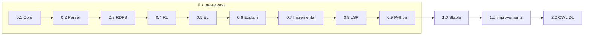

# OntoLogos Roadmap

OntoLogos is a Rust-native ontology reasoner built to replace JVM-bound reasoning workflows with an embeddable engine, CLI, Python bindings, and future IDE integration.

Releases follow semantic versioning. **0.x** builds capability toward **1.0**; **1.x** hardens and extends the stable API; **2.0** introduces full OWL DL reasoning.

For architecture and API details, see [SPEC.md](SPEC.md). For background and ecosystem vision, see [PLAN.md](PLAN.md).

## Release overview

| Version | Theme | Status |
|---------|-------|--------|
| **0.1** | Research & core data model | **Complete** |
| **0.2** | Parsing & profile detection | Planned |
| **0.3** | RDFS engine | Planned |
| **0.4** | OWL RL engine | Planned |
| **0.5** | OWL EL classifier & query | Planned |
| **0.6** | Explanation engine | Planned |
| **0.7** | Incremental reasoning | Planned |
| **0.8** | Language server (Ontocode) | Planned |
| **0.9** | Python ecosystem | Planned |
| **1.0** | Stable release | Planned |
| **1.1+** | Post-1.0 improvements | Planned |
| **2.0** | Full OWL DL | Planned |

**Current milestone:** v0.1 core data model complete. Next: **v0.2** parsing and profile detection.

---

## Ecosystem vision

OntoLogos is the reasoning layer in a broader Rust ontology stack:

| Project | Role |
|---------|------|
| **OntoLogos** | Reasoning engine |
| **OntoIndex** | Ontology query and index engine |
| **Ontocode** | VS Code extension |
| **OntoHub** | Registry and collaboration platform |

---

## Goals

### Primary

1. Replace JVM-bound reasoning workflows
2. Provide embeddable Rust APIs
3. Support Python data science workflows
4. Enable IDE-native ontology development
5. Support large ontology repositories

### Non-goals (1.x)

- Full OWL 2 DL parity with HermiT
- Distributed reasoning
- Triple store replacement

---

# 0.x — Pre-release

## v0.1 — Research & core data model

Establish the technical foundation and in-memory ontology representation all engines share.

### Research

- [x] OWL 2 standards review (`docs/internal/research/owl2.md`)
- [x] HermiT architecture study (`docs/internal/research/hermit.md`)
- [x] ELK architecture study (`docs/internal/research/elk.md`)
- [x] RDFox evaluation (`docs/internal/research/rdfox.md`)
- [x] Benchmark corpus manifest under `benchmarks/` (Pizza, Family, GALEN, Gene Ontology, SNOMED subsets)

### `ontologos-core`

- [x] Workspace crate and stub API (`Ontology`, `Reasoner`, `EntityKind`, axiom types)
- [x] IRI intern pool
- [x] Full axiom model
- [x] Ontology graph
- [x] Entity registry
- [x] Serialization layer

**Performance target:** ontology load under 500ms for medium ontologies with stable allocation patterns.

### Exit criteria

- Research notes committed under `docs/internal/research/`
- Benchmark manifest documents sources and expected profiles
- Core model stores interned IRIs, entities, and axioms with unit tests

---

## v0.2 — Parsing & profile detection

Load real ontologies from disk and detect which OWL profile they fall into.

### `ontologos-parser`

- [x] Workspace crate and format detection stubs
- [ ] horned-owl integration
- [ ] OWL/XML
- [ ] RDF/XML
- [ ] Turtle
- [ ] Functional Syntax

### `ontologos-profile`

- [x] Workspace crate and report types
- [ ] OWL EL detection
- [ ] OWL RL detection
- [ ] OWL QL detection
- [ ] OWL DL detection
- [ ] Diagnostics for unsupported constructs

### Exit criteria

- `Ontology::from_file` loads benchmark ontologies into the core model
- `ontologos profile` returns accurate detection and diagnostics
- Unit tests for parser, core model, and profile detector

---

## v0.3 — RDFS engine

**Crate:** `ontologos-rdfs`

### Features

- [ ] `SubClassOf`
- [ ] `SubPropertyOf`
- [ ] Domain
- [ ] Range
- [ ] Type propagation
- [ ] Transitive closure

### Deliverables

- [ ] Reasoning report
- [ ] Materialized graph (`ontologos materialize`)
- [ ] Initial explanation traces

**Complexity goal:** O(n log n)

### Exit criteria

- RDFS conformance tests pass
- Materialize command produces correct inferences on benchmark ontologies

---

## v0.4 — OWL RL engine

**Crate:** `ontologos-rl`

### Rules

- [ ] `equivalentClass`
- [ ] `equivalentProperty`
- [ ] `sameAs`
- [ ] `inverseOf`
- [ ] `transitiveProperty`
- [ ] `symmetricProperty`
- [ ] Disjointness

### Implementation

- [ ] Forward chaining
- [ ] Rule indexing (`HashMap<EntityId, Vec<TripleId>>`)
- [ ] Parallel rule execution

**Performance goal:** million-triple datasets.

### Exit criteria

- OWL RL benchmark suite passes
- Parallel execution shows measurable speedup on large inputs

---

## v0.5 — OWL EL classifier & query

**Crates:** `ontologos-el`, `ontologos-query`

### Features

- [ ] Completion rules and saturation
- [ ] Taxonomy generation
- [ ] Existential restrictions
- [ ] Intersections
- [ ] Unsatisfiable class detection
- [ ] Equivalent class detection
- [ ] Query API (subsumption, direct subclasses)

### Deliverables

- [ ] Class hierarchy output
- [ ] `ontologos classify` produces taxonomy on EL benchmarks

### Exit criteria

- Classify command produces correct taxonomy on EL benchmark ontologies
- Unsatisfiable and equivalent classes reported accurately

---

## v0.6 — Explanation engine

**Crate:** `ontologos-explain`

### Features

- [ ] Proof graph (`ProofNode`, rule + premises)
- [ ] "Why inferred?" explanations
- [ ] "Why inconsistent?" explanations
- [ ] Minimal justification extraction
- [ ] Human-readable traces
- [ ] JSON and graph export

### Exit criteria

- `ontologos explain` returns valid proof trees for benchmark inferences
- Explanations integrate with RDFS, RL, and EL engines

---

## v0.7 — Incremental reasoning

### Capabilities

- [ ] File watch mode
- [ ] Delta reasoning (re-classify changed axioms only)
- [ ] IDE integration APIs for Ontocode

### Exit criteria

- Incremental re-classification is faster than full re-classification on typical edit workloads

---

## v0.8 — Language server (Ontocode)

Support **Ontocode** with live reasoning feedback.

### Features

- [ ] Live diagnostics
- [ ] Autocomplete
- [ ] Hover explanations
- [ ] Consistency warnings

### Exit criteria

- Ontocode prototype consumes OntoLogos APIs for at least diagnostics and hover

---

## v0.9 — Python ecosystem

**Crate:** `ontologos-py` (published as `ontologos` on PyPI)

### Features

- [x] PyO3 bindings skeleton (`Reasoner` class)
- [ ] Maturin build and PyPI packaging
- [ ] pandas integration
- [ ] polars integration
- [ ] Notebook workflow examples

### Exit criteria

- `pip install ontologos` works on Linux and macOS
- Classification and explanation APIs exposed to Python

---

# 1.0 — Stable release

Gate for production use. All 0.x capabilities integrated, tested, and documented.

### Requirements

- [ ] Stable Rust API
- [ ] Stable CLI (`profile`, `classify`, `materialize`, `explain`)
- [ ] Published documentation
- [ ] Benchmark suite with published results
- [ ] CI/CD (crates.io + PyPI releases)
- [ ] OWL profile conformance suite

### Performance targets

| Ontology size | Classification target |
|---------------|----------------------|
| Small | < 100ms |
| Medium | < 1s |
| Large | < 10s |

### Quality targets

- 90%+ test coverage
- No JVM dependency
- Full benchmark suite green in CI

---

# 1.x — Post-1.0 improvements

Incremental releases after 1.0 that preserve API stability.

## v1.1 — Performance & benchmarks

- [ ] Criterion benchmarks in CI with regression tracking
- [ ] Published benchmark results for all standard corpora
- [ ] Memory profiling and allocation improvements

## v1.2 — CLI & export polish

- [ ] YAML output format
- [ ] Richer text reporting for classify and explain
- [ ] `--watch` mode for incremental reasoning (if not shipped in 0.7)

## v1.3 — Ontocode integration

- [ ] Stable LSP protocol surface
- [ ] Ontocode extension published to VS Code marketplace
- [ ] Hover and diagnostic conformance tests

## v1.4 — Python maturity

- [ ] Windows wheel support
- [ ] Type stubs (py.typed)
- [ ] Polars and pandas DataFrame export for taxonomies

Future 1.x releases will be scoped based on community feedback after 1.0.

---

# 2.0 — Full OWL DL

Major release introducing OWL 2 DL reasoning beyond the 1.x profile scope.

### Features

- [ ] Hypertableau engine
- [ ] Nominals
- [ ] Cardinality restrictions
- [ ] Datatype reasoning
- [ ] Full OWL DL support

### Non-goals carried forward

- Distributed reasoning
- Triple store replacement

---

## Success metrics

### Technical

- 90%+ test coverage (from 1.0 onward)
- Full benchmark suite passing
- Zero JVM dependency in the reasoning path

### Community

- crates.io adoption
- Python package adoption
- VS Code / Ontocode integration users
