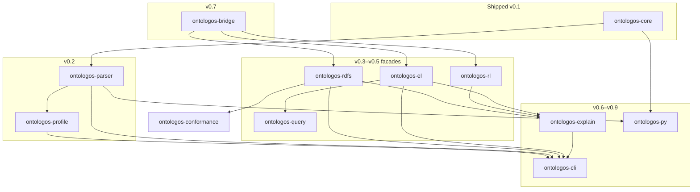
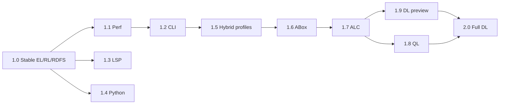

# OntoLogos Roadmap

OntoLogos is a Rust-native ontology reasoner built to replace JVM-bound reasoning workflows with an embeddable engine, CLI, Python bindings, and future IDE integration.

Releases follow [semantic versioning](https://semver.org/). **0.x** builds capability toward **1.0**; **1.x** hardens and extends the stable API; **2.0** introduces full OWL DL reasoning.

For architecture and API details, see [SPEC.md](SPEC.md). For background and ecosystem vision, see [PLAN.md](PLAN.md).

**Last updated:** 2026-06-13 · **Latest tagged release:** **v0.7.0** · **Next release:** **v0.8.0** incremental reasoning · **Current focus:** v0.9 Python maturity

---

## How to read this document

| Symbol | Meaning |
|--------|---------|
| **Complete** | Shipped in a tagged release |
| **In progress** | Active or partially landed on `main` |
| **Planned** | Scoped but not started |
| **Deferred** | Explicitly out of scope for the named release |

Checklists use GitHub task syntax (`- [x]` / `- [ ]`) so progress is visible in diffs. Exit criteria are the release gate — a version ships when its criteria are met, not when every nice-to-have is done.

---

## Release overview

| Version | Theme | Crates unlocked | CLI commands | crates.io |
|---------|-------|-----------------|--------------|-----------|
| **0.1** | Core data model | `ontologos-core` | *(load fails)* | `ontologos-core` |
| **0.2** | Parsing & profiles | `+parser`, `+profile` | `profile` | `+parser`, `+profile` |
| **0.3** | RDFS engine | `+rdfs` | `materialize`, `classify` (RDFS) | `+rdfs` |
| **0.4** | OWL RL engine | `+rl` | — | `+rl` |
| **0.5** | OWL EL & query | `+el`, `+query` | `classify` (OWL EL/RL) | `+el`, `+query` |
| **0.6** | Explanations | `+explain` | `explain` | `+explain` |
| **0.7** | Dependency-first adapters | `+bridge`; reasonable RL/RDFS; in-house EL restored in 0.6.1 | — | `+bridge` |
| **0.8** | Incremental + petgraph polish | query, explain, bridge | — | — |
| **0.9** | Python ecosystem | `+py` | — | PyPI `ontologos` |
| **1.0** | Stable release | all 0.x crates | all four | full set |
| **1.1** | Performance & benchmarks | engines | — | patch releases |
| **1.2** | CLI & export polish | cli | polish | — |
| **1.3** | Ontocode / LSP | `ontologos-lsp`? | — | optional crate |
| **1.4** | Python maturity | `ontologos-py` | — | PyPI |
| **1.5** | Profile & hybrid corpora | `profile`, engines | `--profile auto+` | — |
| **1.6** | ABox & individuals | core, `+abox`? | `instances` | TBD |
| **1.7** | ALC expressivity | `ontologos-alc` | — | TBD |
| **1.8** | OWL QL & queries | `ontologos-ql` | `query` | TBD |
| **1.9** | DL foundations | `ontologos-dl` (preview) | `classify --profile dl-preview` | TBD |
| **2.0** | Full OWL DL | `ontologos-dl` (stable) | `classify --profile dl` | `ontologos-dl` |

Workspace-internal crates (`ontologos-cli`, `ontologos-conformance`) are not published; they consume the library crates above.

---

## Design principles

1. **Core first** — All facades read and write through `ontologos-core`; no engine-specific ontology types in the public API.
2. **Delegate don't duplicate** — OWL parsing via **horned-owl**; EL via **in-house completion** in `ontologos-el`; RL/RDFS via **reasonable**; graph views via **petgraph**. See [dependency-first ADR](docs/internal/design/dependency-first.md).
3. **Fail honestly** — Unimplemented paths return typed errors (`NotImplemented`, `ParseNotAvailable`), not empty success.
4. **Adapter fidelity gates** — HermiT Tier A, Pizza EL golden regression, and Family RL reasonable closure in CI.
5. **Security by default** — Untrusted input (files, JSON) goes through validation and resource limits ([docs/security.md](docs/security.md)).
6. **Incremental publish** — Crates ship to crates.io when their API is stable enough for the milestone.
7. **Upstream gaps** — Track as issues/PRs to reasonable; do not silently reimplement RL/RDFS rule engines in OntoLogos.

---

## Cross-cutting tracks

These run alongside version milestones and are not tied to a single release.

### Benchmarks & conformance

| Track | v0.1 | Target |
|-------|------|--------|
| Criterion serialize bench (10k axioms) | **Complete** | Keep in CI |
| OWL corpus manifest | **Complete** | Extend as engines land |
| Corpus download script | **Complete** | `benchmarks/scripts/download.sh` |
| Manifest-driven integration tests | **Complete** | Skip when `local_path` missing |
| RDFS corpus conformance (Family, Pizza) | **Complete** (v0.3) | Extend per engine |
| HermiT test port harness (`ontologos-conformance`) | **Complete** (v0.4 Tier A) | Tier A in CI (23 tests); Tier B with local `HermiT/` |
| HermiT replacement matrix | **Complete** | [hermit-replacement.md](docs/internal/research/hermit-replacement.md) |
| Pizza EL golden regression (`compare-pizza-el-golden.sh`) | **Complete** (v0.6.1) | CI gate on `main` |
| Family RL triple closure vs reasonable (`compare-reasonable.sh`) | **Complete** (v0.7) | CI gate on `main` |
| Engine conformance suites (ELK CLI, Konclude) | Planned (v1.0+) | Optional external baselines |
| Criterion regression tracking in CI | Planned (v1.1) | Fail on >5% regression |

### HermiT conformance porting

Local HermiT source at `HermiT/` (gitignored) or `ONTOLOGOS_HERMIT_ROOT`. Catalog: [tests/hermit/manifest.toml](tests/hermit/manifest.toml).

| Tier | Runs in CI | HermiT source | OntoLogos milestone |
|------|------------|---------------|---------------------|
| **A** | Yes | Logic inlined (no checkout) | **0.3** RDFS (6); **0.4** RL (17) — see manifest |
| **B** | `#[ignore]` locally | Fixture files under `HermiT/project/test/` | **0.2** parser smoke; **0.5** `ClassificationTest` goldens |
| **C** | Manual / release gate | HermiT JAR + Konclude CLI | **1.9–2.0** DL benchmarks |

**Ported (Tier A):**

- [x] `ontologos-conformance` crate and assertion helpers (`assert_subsumed`, `assert_typed`, …)
- [x] **RDFS (6):** `subsumption1_transitive_subclass`, `sub_and_super_concepts`, `sub_and_super_roles`, `owllink_update_hierarchy_*`
- [x] **RL HermiT (11):** property assertions, inverse/symmetric/transitive, equivalent classes, disjoint clash, sameAs/reflexive (via reasonable facade)
- [x] **RL-native (6):** property subpropagation, inverse/symmetric/transitive assertions, domain/range typing, equivalent classes, disjoint clash

**Ignored via reasonable upstream gaps** (see [dependency-first ADR](docs/internal/design/dependency-first.md); tracked upstream, not reimplemented): existential TBox subsumption (`testSubsumption2/3`), equivalentProperty → mutual subPropertyOf, property-characteristic propagation along subPropertyOf, domain/range on subproperty typing superproperty assertions.

**Explicitly excluded from Tier A** (see manifest `status = "excluded"`): `testSubProperties`, `testObjectPropertyHierarchy` (inverse in subPropertyOf).

**Next ports:**

- [x] `ClassificationTest` pizza taxonomy golden — **0.5** EL (CI via `compare-pizza-el-golden.sh`)
- [ ] `ClassificationTest` wine / galen taxonomy goldens — wine blocked on `wine.xml` parse error
- [ ] `owl_wg_tests` approved entailment subset — **1.0**
- [ ] `structural/ClausificationTest` — **2.0** DL internal
- [ ] SWRL `RulesTest` — **deferred** (out of scope 1.x)

**Known gaps from HermiT fixture survey:**

- [ ] ISO-8859-1 RDF/XML (65 OWLLink files) — horned-owl UTF-8 only; transcode or alternate reader
- [ ] Complex OWLLink ontologies (`9.owl`, `situation.owl`) — parser/mapping follow-up

### Security & limits

| Track | v0.1 | Target |
|-------|------|--------|
| JSON v2 `Limits` for deserialization | **Complete** | Extend for file parse limits |
| IRI scheme allowlist | **Complete** | Maintain |
| Parser path traversal checks | **Complete** (stub path) | Keep for all load paths |
| Fuzzing / proptest for parser | Planned (v0.2) | OWL/XML + RDF/XML first |

### Documentation

| Track | v0.1 | Target |
|-------|------|--------|
| docs.rs for `ontologos-core` | **Complete** | Per published crate |
| JSON v2 schema doc | **Complete** | Keep in sync |
| Comparison guide | **Complete** | Update each milestone |
| Migration notes per release | Planned (v0.2+) | CHANGELOG + short upgrade guide |

---

## Ecosystem vision

OntoLogos is the reasoning layer in a broader Rust ontology stack:

| Project | Role | Relationship to OntoLogos |
|---------|------|---------------------------|
| **OntoLogos** | Reasoning engine | This repository |
| **OntoIndex** | Query and index engine | Consumes classified ontologies |
| **Ontocode** | VS Code extension | LSP client (v1.3; incremental APIs from v0.8) |
| **OntoHub** | Registry and collaboration | Distribution; out of scope for 1.0 |

---

## Goals

### Primary

1. Replace JVM-bound **batch** reasoning in Rust and Python pipelines
2. Provide embeddable, allocation-conscious Rust APIs
3. Support Python data science workflows (PyPI package)
4. Enable IDE-native ontology development via Ontocode
5. Handle medium-to-large ontologies (GO-scale subsets, not full SNOMED in CI)

### Non-goals (1.x)

- Full OWL 2 DL parity with HermiT
- Distributed or federated reasoning
- Triple store or SPARQL endpoint replacement
- Interactive ontology editing (delegated to Protégé / Ontocode)

### Comparison baseline

See [docs/comparison.md](docs/comparison.md) for an honest maturity matrix vs HermiT, ELK, Protégé, and owlready2.

---

# 0.x — Pre-release

## v0.1 — Core data model

**Status: Complete** ([v0.1.0](https://github.com/eddiethedean/ontologos/releases/tag/v0.1.0), 2026-06-11)

Establish the in-memory ontology representation all engines share.

### Research

- [x] OWL 2 standards review → [docs/internal/research/owl2.md](docs/internal/research/owl2.md)
- [x] HermiT architecture study → [docs/internal/research/hermit.md](docs/internal/research/hermit.md)
- [x] HermiT replacement matrix → [docs/internal/research/hermit-replacement.md](docs/internal/research/hermit-replacement.md)
- [x] ELK architecture study → [docs/internal/research/elk.md](docs/internal/research/elk.md)
- [x] RDFox evaluation → [docs/internal/research/rdfox.md](docs/internal/research/rdfox.md)
- [x] Reasoner landscape survey → [docs/internal/research/landscape-2023.md](docs/internal/research/landscape-2023.md)
- [x] Konclude, MORe, Rust ecosystem studies → [konclude.md](docs/internal/research/konclude.md), [more.md](docs/internal/research/more.md), [rust-ecosystem.md](docs/internal/research/rust-ecosystem.md)
- [x] Benchmark corpus manifest → [benchmarks/manifest.toml](benchmarks/manifest.toml)

### `ontologos-core`

- [x] `InternPool` / `IriId` with validation and scheme allowlist
- [x] `EntityRegistry` with kind validation (`Class`, `Individual`, properties)
- [x] Structured `Axiom` enum with validation
- [x] `AxiomStore` (deduplicating) and `AxiomIndex` (subclass, subproperty, equivalence, inverse, …)
- [x] `Ontology` facade and `OntologyBuilder`
- [x] JSON snapshot **v2** (`to_json` / `from_json` / `from_json_with_limits`)
- [x] `Reasoner` / `ReasonerBuilder` API skeleton (`classify()` → `NotImplemented`)
- [x] Criterion benchmark: 10k-axiom serialize/deserialize
- [x] Integration tests, security regressions, `pizza_minimal` fixture

### Workspace stubs at v0.1 (superseded by v0.2 for parser/profile/cli)

- [x] `ontologos-rdfs`, `ontologos-rl`, `ontologos-el`, `ontologos-query`, `ontologos-explain` — typed stubs
- [x] `ontologos-py` — PyO3 `Reasoner` skeleton

### Exit criteria (met)

- [x] `ontologos-core` published to crates.io
- [x] JSON v2 round-trip tests green
- [x] `cargo test --workspace` and `cargo clippy -D warnings` pass in CI

---

## v0.2 — Parsing & profile detection

**Status: Complete** ([v0.2.0](https://github.com/eddiethedean/ontologos/releases/tag/v0.2.0), 2026-06-11) · **Depends on:** v0.1

Load real ontologies from disk, map them into the core model, and report which OWL profile they fall into.

### Phase A — Parser foundation

**Crate:** `ontologos-parser`

- [x] Format detection by extension and content sniffing
- [x] Path normalization and traversal rejection
- [x] `horned-owl` dependency and error mapping
- [x] OWL/XML reader
- [x] RDF/XML reader
- [x] Horned-owl → `ontologos-core` axiom mapping layer
- [x] `load_ontology` entry point (core `Ontology::from_file` remains stub by design)
- [x] Parse limits (max file size, max axioms) aligned with [docs/security.md](docs/security.md)

### Phase B — Additional formats

- [x] Turtle / `.ttl`
- [x] OWL Functional Syntax (`.ofn`, `.func`)
- [x] Unified `load_ontology` entry point used by CLI

### Phase C — Core extensions (as needed)

- [x] Audit horned-owl constructs against [SPEC.md](SPEC.md) axiom list
- [x] Add axiom variants: `SubClassOfExistential`, RL property declarations
- [x] Document unsupported constructs and emit parser warnings (`ParseMeta`)

### Phase D — Profile detection

**Crate:** `ontologos-profile`

- [x] `ProfileReport`, `ProfileDiagnostic`, `OwlProfile` types
- [x] Construct scanner over mapped axioms and `ParseMeta`
- [x] OWL EL / RL / QL / DL detection with hybrid diagnostics
- [ ] `ReasonerBuilder::profile(Profile::Auto)` reads detector (stub until v0.5 classify)

### Tooling & tests

- [x] `benchmarks/scripts/download.sh` for Pizza and Family corpora
- [x] Manifest-driven integration tests
- [x] Parser mapping tests per format
- [x] Profile unit tests and hybrid diagnostics tests

### CLI

- [x] `ontologos profile <file>` — text and JSON output
- [x] Remaining subcommands load ontology then fail at engine (`NotImplemented`)

### Exit criteria (met)

- [x] `load_ontology` loads Pizza and Family into core without panic
- [x] Parsed axiom counts within 10% of manifest `axiom_count_approx`
- [x] `ontologos profile` reports expected profiles for Pizza (`Dl` as of v0.3 mapper) and `Rl` for Family
- [x] `ontologos-parser` and `ontologos-profile` published to crates.io
- [x] No new `unsafe` (workspace lint enforced)

### Risks

| Risk | Mitigation |
|------|------------|
| `horned-owl` construct coverage gaps | Map supported axioms first; diagnostics for the rest |
| ISO-8859-1 RDF/XML (HermiT OWLLink corpus) | Skip in survey tests; transcode fixtures or add reader (see HermiT track) |
| Large files (GO) exhaust memory | Parse limits; CI uses `go-subset` only |
| Complex class expressions in EL corpora | Store for profile detection; full EL reasoning is v0.5 |

---

## v0.3 — RDFS engine

**Status: Complete** (v0.3.0, 2026-06-12) · **Facade migration:** v0.7 delegates to **reasonable** · **Depends on:** v0.2

**Crate:** `ontologos-rdfs` (stable public facade)

First reasoning engine. v0.3 shipped a custom RDFS rule engine; **v0.7 replaces internals** with `reasonable` via `ontologos-bridge`. Public API unchanged.

### Rules (historical v0.3; now via reasonable where supported)

- [x] `rdfs:subClassOf` propagation (transitive closure) — **reasonable rdfs11**
- [ ] `rdfs:subPropertyOf` propagation — **upstream gap** (rdfs5–8 not in reasonable)
- [ ] `rdfs:domain` / `rdfs:range` inheritance along `subPropertyOf` — **upstream gap**
- [ ] `rdf:type` propagation where representable in core (deferred to v1.6 — requires ABox)

### Implementation

- [x] `RdfsEngine::materialize` produces inferred axioms in core
- [x] `materialize_reasoner` with `Profile::Rdfs` delegates here
- [x] Fixed-point materialization via **reasonable** (v0.7+)

### Deliverables

- [x] Materialization report (counts of new axioms by rule)
- [x] `ontologos materialize <file>` — text status and JSON summary
- [x] `ontologos classify <file>` — RDFS materialization via `Profile::Rdfs`
- [x] Initial inference traces (feeds v0.6 explain)

### Conformance & polish

- [x] DL profile diagnostics when mapped constructs rule out EL/RL (Pizza corpus)
- [x] `classify_reasoner` + CLI/Python `classify` for `Profile::Rdfs`
- [x] Parser security: path prefix bypass, entity-limit axiom drop, datatype/class same IRI
- [x] HermiT Tier-A RDFS ports in `ontologos-conformance`
- [x] `cargo test -p ontologos-conformance` in CI
- [x] Tag and publish **v0.3.0** to crates.io

### Exit criteria

- [x] RDFS conformance tests pass on Family corpus
- [x] Materialized Pizza ontology is a strict superset of parsed axioms
- [x] HermiT Tier-A RDFS ports pass (`ontologos-conformance`)
- [x] `ontologos-rdfs` published to crates.io

---

## v0.4 — OWL RL engine

**Status: Shipped (v0.4.0)** · **Facade migration:** v0.7 delegates to **reasonable** · **Depends on:** v0.3

**Crate:** `ontologos-rl` (stable public facade)

v0.4 shipped custom OWL RL forward-chaining; **v0.7 replaces internals** with `reasonable` via `ontologos-bridge`. Custom `rules/` and `triple_index.rs` removed.

### Rules (historical v0.4; now via reasonable where supported)

- [x] `equivalentClass` / property assertions / characteristics (where reasonable implements OWL RL rules)
- [x] `sameAs` / `differentFrom` (where in RL fragment)
- [x] `inverseOf`, symmetric/transitive/reflexive property assertions
- [ ] `hasKey`, property chain axioms (deferred; parser not mapped)
- [x] Disjointness clash detection (via reasonable diagnostics)

### Implementation

- [x] `RlEngine::saturate` via **reasonable** `ReasonerBuilder` (v0.7+)
- [x] `ontologos_rl::classify_reasoner` for `Profile::Rl`
- [x] ~~`TripleIndex` / custom rayon rule pool~~ removed in v0.7

### Conformance

- [x] Port HermiT `ReasonerTest` RL-relevant cases (subsumption, sameAs, equivalent instances, reflexive, property chars, retrieval)
- [x] RL-native Tier-A coverage (property propagation, inverse/symmetric/transitive, domain/range, disjoint clash)
- [x] Expand [tests/hermit/manifest.toml](tests/hermit/manifest.toml) with ported + excluded entries

### Exit criteria

- [x] RL conformance tests pass on Family corpus (via reasonable facade)
- [x] `compare-reasonable.sh` CI gate — triple closure on mapped Family axioms
- [x] ~~Parallel smoke / custom Criterion bench~~ removed with custom engine
- [x] `ontologos-rl` on crates.io; publish script includes `ontologos-bridge`

> **Research:** [rust-ecosystem.md](docs/internal/research/rust-ecosystem.md) — `reasonable` is the active open Rust RL peer; RDFox remains aspirational for performance.

---

## v0.5 — OWL EL classifier & query

**Status: Complete** · **EL engine:** in-house completion restored in **v0.6.1** (supersedes brief whelk experiment) · **Depends on:** v0.2

**Crates:** `ontologos-el`, `ontologos-query`

v0.5 shipped custom EL completion; v0.6.0 briefly delegated to whelk (git); **v0.6.1** restored in-house `graph.rs` / `taxonomy_extract.rs`.

### `ontologos-el`

- [x] EL classification via in-house ELK-style completion (v0.6.1+)
- [x] `core_to_horned` / taxonomy mapping in `ontologos-bridge`
- [x] Taxonomy extraction with petgraph transitive reduction
- [x] Unsatisfiable class detection, equivalence clustering
- [x] `ElClassifier::classify` returns `Taxonomy`
- [x] `classify_with_profile` / CLI `--profile el|auto`
- [ ] `load_horned_owl()` EL fast-path (skip core round-trip) — optional follow-up

### `ontologos-query`

- [x] `QueryEngine` hierarchy queries over classified taxonomy
- [x] **petgraph** `DiGraph` for subsumption traversal (v0.7 partial)

### CLI

- [x] `ontologos classify <file>` — OWL taxonomy summary (text + JSON); RDFS path shipped in v0.3
- [x] `--profile el|rl|rdfs|auto` routes to correct engine

### Conformance

- [x] Port HermiT `ClassificationTest` (pizza vendored; wine optional) — Tier B
- [x] `assert_hierarchies` equivalent: taxonomy text or structured `(sub, super)` pairs vs golden file

### Exit criteria

- [x] Pizza EL taxonomy golden (`pizza-el-golden.json`) — in-house EL baseline via `compare-pizza-el-golden.sh` in CI
- [x] `go-subset` classifies within performance budget
- [x] `ontologos-el` and `ontologos-query` on crates.io

> **Research:** ELK remains the performance reference; **whelk-rs** is an ecosystem peer. HermiT `ClassificationTest` is a secondary cross-check.

---

## v0.6 — Explanation engine

**Status: Complete** ([v0.7.0](https://github.com/eddiethedean/ontologos/releases/tag/v0.7.0)) · **Adapter note:** RL/RDFS rule traces empty until reasonable exposes diagnostics · **Depends on:** v0.3–v0.5

**Crate:** `ontologos-explain`

### Features

- [x] `ProofGraph`, `ProofNode`, `NodeId` types
- [x] `ReasonerConfig::explanations` flag (EL traces populated; RL/RDFS traces empty under reasonable adapter)
- [x] Proof graph construction from asserted axioms + EL inference traces
- [x] **petgraph** acyclic validation (`ProofGraph::is_acyclic`)
- [x] JSON export; CLI `ontologos explain`

### Exit criteria

- [x] Benchmark suite validates materialization + taxonomy across engines (≥10 combined inferences)
- [x] Proof graphs are acyclic and reference valid axiom ids
- [ ] Per-rule RL/RDFS traces — **deferred to upstream** (EL-first taxonomy explanations today)
- [x] `ontologos-explain` and `ontologos-bridge` on crates.io (**v0.7.0**)

---

## v0.7 — Dependency-first adapters

**Status: Complete** ([v0.7.0](https://github.com/eddiethedean/ontologos/releases/tag/v0.7.0), 2026-06-13) · **Depends on:** v0.3–v0.6

Replace in-house RL/RDFS rule engines with **reasonable**; EL uses in-house completion (whelk experiment reverted in 0.6.1). Public crate names and CLI/Python APIs unchanged.

### `ontologos-bridge` (new)

- [x] `core_to_horned` / horned-owl conversions
- [x] `core_to_triples` / `merge_triples_into_ontology` for reasonable
- [x] Existential restriction encoding (blank-node OWL RDF)
- [x] Taxonomy mapping + petgraph transitive reduction
- [x] Fidelity tests (Family, Pizza, transitive chain)

### Facades

- [x] `ontologos-el` → in-house ELK-style completion (v0.6.1; supersedes brief whelk delegation)
- [x] `ontologos-rl` / `ontologos-rdfs` → **reasonable**
- [x] Delete custom `ontologos-rl/src/rules/`, `triple_index.rs`, `ontologos-rdfs/src/rules.rs`

### CI & docs

- [x] `compare-pizza-el-golden.sh` — Pizza golden regression gate
- [x] `compare-reasonable.sh` — Family triple-closure gate
- [x] ADR, architecture, comparison, Python guide updated
- [x] HermiT Tier A tests annotated; upstream gaps `#[ignore]` not reimplemented

### Exit criteria

- [x] `cargo test --workspace` and `clippy -D warnings` green
- [x] No duplicate rule implementations in workspace
- [x] Public API stable: `load_ontology`, `classify_with_profile`, CLI subcommands
- [x] Tag and publish **v0.7.0** — [release notes](.github/release/v0.7.0.md); 9 crates on crates.io + PyPI `ontologos` **0.7.0**

> **Upstream gaps:** See [dependency-first ADR](docs/internal/design/dependency-first.md). Track in reasonable issues; do not silently reimplement RL/RDFS rules.

---

## v0.8 — Incremental reasoning + petgraph polish

**Status: Complete on `main`** (ships in **v0.8.0**) · **Effort:** Medium · **Depends on:** v0.7 ✓

### Capabilities

- [x] **petgraph** taxonomy views in `ontologos-query` (landed in v0.7)
- [x] **petgraph** proof-graph acyclic check in `ontologos-explain` (landed in v0.7)
- [x] Axiom-level dirty tracking in core
- [x] EL: partition-based overdelete-rederive (Kazakov ISWC 2013) on in-house `CompletionGraph`
- [x] **reasonable** incremental materialization wrapper (`ReasonerConfig::incremental`)
- [x] File-watch API for Ontocode (`ontologos-watch` library; CLI `--watch` deferred to v1.2)

### Exit criteria

- [x] Incremental EL re-classification is ≥ 5× faster than full classify on 10-axiom delta (see `bench-el-incremental.sh`, `#[ignore]` perf test)
- [x] Correctness: incremental taxonomy equals full classify on documented edit suite (`incremental_correctness.rs`)

> **Research:** ELK incremental design in [elk.md](docs/internal/research/elk.md); prefer reasonable/whelk upstream incremental APIs over custom rule replay.

---

## v0.9 — Python ecosystem

**Status: In progress (alpha on PyPI)** · **Depends on:** v0.2, v0.5, v0.7 facades

**Crate:** `ontologos-py` · **PyPI name:** `ontologos`

### Features

- [x] PyO3 `Reasoner` with `profile="rdfs"|"rl"|"el"|"auto"` (routes to facades)
- [x] CI: maturin develop + pytest on Linux
- [x] Python guide documents dependency stack and when to use upstream crates directly
- [x] Maturin manylinux / macOS / Windows wheels on PyPI (v0.7.0 Release workflow)
- [ ] `Ontology` construction from Python (builder or dict)
- [ ] `explain()` bindings with adapter trace limits documented
- [ ] Optional pandas / polars export for taxonomies

### Exit criteria

- [ ] `pip install ontologos` works on Linux and macOS (aarch64 + x86_64)
- [ ] Python integration test classifies Pizza and matches Rust CLI output
- [x] PyPI release in CI on version tag (v0.7.0+)

---

# 1.0 — Stable release

**Status: Planned** · **Gate for production use**

All 0.x capabilities integrated, tested, documented, and semver-stable.

### Requirements

- [ ] `#![deny(missing_docs)]` on all published crates
- [ ] Stable Rust API with deprecation policy documented
- [ ] CLI: `profile`, `classify`, `materialize`, `explain` fully functional
- [ ] docs.rs complete for every published crate
- [ ] Benchmark suite with published results in [benchmarks/README.md](benchmarks/README.md)
- [ ] CI gates on whelk + reasonable conformance (Pizza golden, Family RL closure)
- [ ] HermiT Tier-B ports for EL/RL classification goldens
- [ ] Automated crates.io + PyPI release workflow
- [x] MSRV policy documented (currently 1.88+; driven by `horned-owl` 1.4)

### Performance targets

| Corpus class | Axioms (approx.) | Classify target |
|--------------|------------------|-----------------|
| Small (Family) | < 100 | < 100 ms |
| Medium (Pizza) | ~ 800 | < 1 s |
| Large (go-subset) | ~ 10k | < 10 s |

### Quality targets

- ≥ 90% line coverage on published crates (measured in CI)
- Zero JVM dependency in the reasoning path
- Full workspace `clippy -D warnings` clean

---

# 1.x — Post-1.0 ladder (1.0 → 2.0)

Incremental releases after 1.0. **API breaking changes require 2.0.** Versions 1.1–1.4 harden the 1.0 platform; 1.5–1.9 extend expressivity toward full OWL DL so 2.0 is an integration release, not a greenfield rewrite.

| Phase | Versions | Theme |
|-------|----------|-------|
| **Hardening** | 1.1–1.2 | Performance, CLI, ops |
| **Ecosystem** | 1.3–1.4 | IDE and Python adoption |
| **Expressivity** | 1.5–1.7 | Richer OWL fragments toward DL |
| **Query** | 1.8 | OWL QL and structured queries |
| **DL prep** | 1.9 | Tableau scaffolding and preview |
| **DL** | 2.0 | Full OWL 2 DL |

---

## v1.1 — Performance & benchmarks

**Status: Planned** · **Effort:** Medium · **Depends on:** 1.0

- [ ] Criterion benchmarks in CI with regression tracking (fail on > 5% regression)
- [ ] Published results table for all standard corpora in [benchmarks/README.md](benchmarks/README.md)
- [ ] Memory profiling and hot-path allocation reduction in **bridge + facades** (not custom engines)
- [ ] `cargo bench` documented per published crate
- [ ] Load-time budget: Pizza parse + classify < 500 ms on reference hardware

### Exit criteria

- [ ] Benchmark CI job runs on every PR to `main`
- [ ] Published numbers for Pizza, Family, and `go-subset`

---

## v1.2 — CLI & export polish

**Status: Planned** · **Effort:** Small · **Depends on:** 1.0

- [ ] YAML output format (`--format yaml`)
- [ ] Richer text reporting for `classify` and `explain`
- [ ] `ontologos --watch` for incremental file reload (uses v0.8 incremental APIs)
- [ ] Shell completions (`clap_complete`)
- [ ] `--timeout` and `--parallelism` flags on classify

### Exit criteria

- [ ] All four subcommands support `--format json|yaml|text`
- [ ] Completions shipped for bash, zsh, and fish

---

## v1.3 — Ontocode integration

**Status: Planned** · **Effort:** Medium · **Depends on:** 1.0, v0.8 LSP APIs

- [ ] Stable LSP protocol surface (versioned separately from core semver)
- [ ] `ontologos-lsp` crate or documented `ontologos_core::lsp` module
- [ ] Ontocode extension published to VS Code marketplace
- [ ] Diagnostic and hover conformance test suite
- [ ] Cancellation tokens for long classify runs in IDE

### Exit criteria

- [ ] Ontocode v1 uses only documented OntoLogos APIs (no private crate internals)
- [ ] Pizza ontology: unsat warning and hover superclass list verified in CI

---

## v1.4 — Python maturity

**Status: Planned** · **Effort:** Medium · **Depends on:** 1.0, v0.9 Python bindings

- [ ] Windows wheel support (x86_64)
- [ ] Type stubs (`py.typed`) and `mypy` clean in examples
- [ ] Polars and pandas DataFrame export for taxonomies
- [ ] Async-friendly classify API (optional `asyncio` feature)
- [ ] Documented migration from owlready2 for batch EL workflows

### Exit criteria

- [ ] `pip install ontologos` on Windows, Linux, macOS (aarch64 + x86_64)
- [ ] Python classify output matches Rust CLI on Pizza integration test

---

## v1.5 — Profile completeness & hybrid corpora

**Status: Planned** · **Effort:** Large · **Depends on:** 1.0

Real ontologies mix EL-safe TBox with RL/DL axioms. **MORe** (Oxford) proves module-based black-box composition outperforms single-reasoner selection — see [more.md](docs/internal/research/more.md).

### Module routing (`Reasoner` facade)

- [ ] ⊥-module or signature extraction over `ontologos-core` (Rust-native; no OWL API)
- [ ] Classify EL module with `ontologos-el`; RL residue with `ontologos-rl`; DL residue with `ontologos-dl` preview (when available)
- [ ] Merge taxonomies from module results
- [ ] TBox-first scope (ABox deferred to v1.6, matching MORe initial semantics)

### `ontologos-profile`

- [ ] Hybrid ontology report: EL / RL / DL construct partitions per module
- [ ] `Profile::Auto` invokes MORe-style orchestration, not single-engine pick

### Engines

- [ ] Document reasonable/whelk coverage vs OWL 2 RL/EL spec (extend [dependency-first ADR](docs/internal/design/dependency-first.md))
- [ ] Hybrid test ontologies in `benchmarks/manifest.toml`

### Exit criteria

- [ ] GALEN hybrid report: EL module classifies without false DL delegation on EL-safe fragment
- [ ] Hybrid corpus taxonomy matches MORe (ELK+HermiT) or Konclude reference within documented tolerance

---

## v1.6 — ABox & individual reasoning

**Status: Planned** · **Effort:** Large · **Depends on:** 1.5

**Crates:** `ontologos-core` extensions, optional `ontologos-abox`

Full DL requires individual assertions. EL/RL pipelines also benefit from typed instances and `sameAs` closure.

### Core extensions

- [ ] ABox axiom types: `ClassAssertion`, `ObjectPropertyAssertion`, `DataPropertyAssertion`
- [ ] `NegativePropertyAssertion` (RL subset)
- [ ] Individual typing propagation integrated with RL engine
- [ ] `sameAs` / `differentFrom` closure (RL and ABox modules)

### `ontologos-abox` (if not folded into RL)

- [ ] Instance typing report
- [ ] Consistency check for asserted individuals
- [ ] CLI: `ontologos instances <file>` — list types and conflicts

### Exit criteria

- [ ] Family corpus: all asserted individuals typed correctly after materialize
- [ ] `sameAs` chain closure matches RL reference on synthetic fixture
- [ ] ABox axioms round-trip through JSON v3 (schema bump; v2 remains supported for TBox-only)

---

## v1.7 — ALC expressivity (pre-DL TBox)

**Status: Planned** · **Effort:** Large · **Depends on:** 1.6

**Crate:** `ontologos-alc`

Bridge between EL completion and full tableau: **ALC** (attributive language with complement) — unions, negation, and universal restrictions without nominals or cardinality.

### Features

- [ ] Internal normal form for ALC class expressions
- [ ] Universal restrictions (∀R.C)
- [ ] Unions and complements in class expressions (stored or normalized on load)
- [ ] Tableau-lite saturation for ALC (single global tableau, no hypertableau yet)
- [ ] Unsatisfiability under ALC semantics
- [ ] `Reasoner::classify` with `Profile::Alc` (new variant, non-breaking if enum is `#[non_exhaustive]`)

### Exit criteria

- [ ] ALC benchmark suite (standard literature ontologies + synthetic) passes vs reference
- [ ] Pizza + ALC extension axioms: unsat detected where expected
- [ ] Documented boundary: ALC in 1.7, not full DL

---

## v1.8 — OWL QL & structured queries

**Status: Planned** · **Effort:** Large · **Depends on:** 1.5, 1.7

**Crate:** `ontologos-ql`

OWL QL supports query answering via rewriting over EL/RL class hierarchies. Integrates with **OntoIndex** for embeddable query workflows.

### Features

- [ ] OWL QL profile detection refinement (conjunctive query shapes)
- [ ] Conjunctive query AST and parser (functional or SPARQL subset — decision at implementation)
- [ ] Query rewriting over classified taxonomy
- [ ] `QueryEngine` extensions: instance retrieval, conjunctive query answering
- [ ] CLI: `ontologos query <file> --query '<cq>'` (JSON result rows)
- [ ] Stable C API or FFI surface for OntoIndex consumption (optional)

### Exit criteria

- [ ] QL conformance tests from W3C OWL 2 QL test cases (subset documented in SPEC)
- [ ] Query answering on Pizza + ABox extensions matches reference engine

---

## v1.9 — DL engine foundations (preview)

**Status: Planned** · **Effort:** Very large · **Depends on:** 1.7, 1.8

**Crate:** `ontologos-dl` (preview, semver 0.x within workspace until 2.0)

Scaffolding for full DL without committing to 2.0 API stability. Users opt in via feature flag or `--profile dl-preview`.

### Infrastructure (Konclude hybrid model — see [konclude.md](docs/internal/research/konclude.md); HermiT as secondary cross-check in [hermit.md](docs/internal/research/hermit.md))

- [ ] OWL axiom normalizer → internal DL normal form
- [ ] **Coupled saturation + tableau** (pay-as-you-go; not pure hypertableau port)
- [ ] Dependency index keyed by `EntityId` / `AxiomId` (derivation tracking for unsat cache + explain)
- [ ] Tableau expansion core (branching, clash detection, blocking)
- [ ] Taxonomy extraction from saturated tableau
- [ ] **Konclude CLI** + HermiT JAR reference harness in `benchmarks/` (extends `ontologos-conformance` Tier C)
- [ ] Port HermiT `structural/ClausificationTest` as DL internal regression suite

### Preview fragment (ALCH + nominals subset)

- [ ] Role hierarchy (H) integrated with ALC tableau from 1.7
- [ ] Nominals (individuals in class expressions) — limited count per ontology
- [ ] `classify --profile dl-preview` behind explicit CLI warning
- [ ] Explanations for DL preview inferences (reuse v0.6 graph)

### Exit criteria

- [ ] DL preview classifies ≥ 3 published DL benchmark ontologies within 10× **Konclude** time (HermiT secondary where runnable)
- [ ] No panics on DL benchmark corpus; timeouts return structured errors
- [ ] 2.0 RFC issue drafted with API stabilization plan

### Decision criteria (promote preview → 2.0)

- [ ] `ontologos-dl` preview stable for ≥ 3 months without breaking internal APIs
- [ ] Reference harness covers Pizza-DL, Galen-DL subset, and one OBO DL corpus
- [ ] Maintainer sign-off on multi-year support commitment for full DL

---

# 2.0 — Full OWL DL

**Status: Planned** · **Major release** · **Depends on:** 1.9

Promotes `ontologos-dl` from preview to stable. **2.0 is integration and completeness**, not a restart — coupled saturation+tableau lands in 1.9 per [konclude.md](docs/internal/research/konclude.md).

### Scope (complete OWL 2 DL)

- [ ] Hypertableau or Konclude-style tableau optimizations (optional `ReasonerConfig` flag)
- [ ] Full nominal support (unbounded)
- [ ] Cardinality and qualified cardinality restrictions
- [ ] Datatype reasoning (OWL 2 datatypes subset: XSD primitives used in OWL)
- [ ] Full disjointness, keys, and property chains in DL semantics
- [ ] `classify --profile dl` — stable, no preview warning
- [ ] DL explanations parity with EL quality bar

### Performance targets

| Corpus class | Target |
|--------------|--------|
| Medium DL (≤ 5k axioms) | < 30 s classify |
| Large DL (Galen-class) | Best effort; timeout configurable |

### Exit criteria

- [ ] W3C OWL 2 DL test case suite (documented subset) passes above agreed threshold
- [ ] Comparison guide updated: OntoLogos 2.0 vs Konclude (+ HermiT where applicable) on standard corpora
- [ ] `ontologos-dl` published to crates.io with stable API

### Non-goals (carried forward)

- Distributed reasoning
- Triple store or SPARQL endpoint replacement
- Bit-for-bit parity with every HermiT optimization
- OWL 2 Full (non-DL constructs beyond spec scope)

---

## Success metrics

### Technical (from 1.0 onward)

- ≥ 90% test coverage on published crates
- Full benchmark suite passing in CI on every PR
- Zero JVM dependency in the reasoning path
- No critical security advisories on parser or JSON deserialization

### Adoption

- `ontologos-core` downloads on crates.io
- PyPI install base for `ontologos`
- External contributors landing PRs against engine crates
- Ontocode / third-party LSP clients using incremental APIs (v0.8+)

### Community

- Issues and discussions reflect real ontology workflows (not just API bikeshedding)
- Comparison guide updated when milestones ship

---

## Changelog linkage

Release notes are recorded in [CHANGELOG.md](CHANGELOG.md). Each tagged version should update the roadmap status table at the top of this file.
