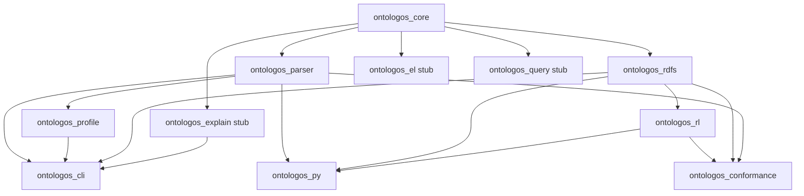
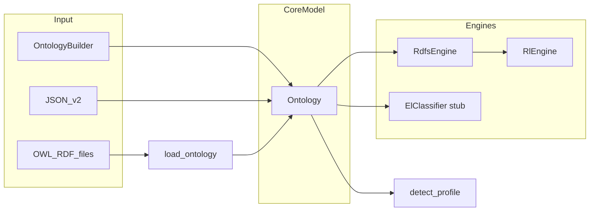

# Architecture Overview

OntoLogos is a Cargo workspace of profile-specific reasoning crates layered on a shared in-memory ontology model. This page is for adopters evaluating integration — see [SPEC.md](project/spec.md) for detailed API status tags.

## Crate dependency graph

Published to crates.io (v0.4): `ontologos-core`, `ontologos-parser`, `ontologos-profile`, `ontologos-rdfs`, `ontologos-rl`.

Workspace-only: `ontologos-cli`, `ontologos-conformance`, `ontologos-py` (also on PyPI).

## Data flow

1. **Construct or load** an `Ontology` (builder, JSON, or parser).
2. **Optionally detect profile** with `ontologos_profile::detect_profile`.
3. **Run an engine** that mutates the ontology in place (adds inferred axioms).
4. **Query indexes** on `Ontology` (subclasses, individuals, property assertions, etc.).

## Core model (`ontologos-core`)

Single in-memory representation:

| Component | Role |
|-----------|------|
| `InternPool` | Deduplicated IRI strings |
| `EntityRegistry` | Typed entities (class, individual, properties) |
| `AxiomStore` | Structured TBox and ABox axioms |
| `AxiomIndex` | Secondary indexes for traversal |
| `ParseMeta` | Parser scan metadata (optional) |

Serialization: JSON snapshot v2 (`to_json` / `from_json`).

**Deliberate split:** `Ontology::from_file` returns `ParseNotAvailable` so `ontologos-core` has no parser dependency. File loading lives in `ontologos-parser`.

## Reasoner facade

`Reasoner` in core is a configuration wrapper around `Ontology`:

| `Profile` | `Reasoner::classify()` in v0.4 | Use instead |
|-----------|-------------------------------|-------------|
| `Auto` | `NotImplemented` | Detect profile, pick engine manually |
| `El` | `NotImplemented` | Wait for v0.5 or external ELK |
| `Rdfs` | Delegate hint (`Error::Message`) | `ontologos_rdfs::classify_reasoner` |
| `Rl` | Delegate hint | `ontologos_rl::classify_reasoner` |

Python `Reasoner` bridges RDFS and RL by calling the profile crates internally.

## Engine layering

| Engine | Crate | Scope |
|--------|-------|-------|
| RDFS | `ontologos-rdfs` | TBox: `subClassOf`/`subPropertyOf` closure, domain/range inheritance |
| OWL RL | `ontologos-rl` | RDFS pass + RL TBox/ABox rules until saturation |
| OWL EL | `ontologos-el` | Stub — completion-based taxonomy (v0.5) |

RL always runs RDFS first inside `RlEngine::saturate`.

## CLI surface

`ontologos-cli` wires parser + profile + RDFS. It does **not** link `ontologos-rl` in v0.4 — RL is library/Python only until v0.5 CLI routing.

## Design choices

| Choice | Rationale |
|--------|-----------|
| No umbrella `ontologos` crate | Depend only on what you need; smaller dependency trees |
| Core/parser split | Embed data model without OWL parse stack |
| In-place materialization | Engines add axioms to the same `Ontology`; no separate triple store |
| Partial OWL mapping | Map named TBox/ABox shapes; scan rest for profile diagnostics |
| Batch fixed-point engines | Saturation loops until no new axioms (not incremental yet) |

## Related

- [Choosing an API](guides/choosing-an-api.md)
- [Supported constructs](reference/supported-constructs.md)
- [SPEC.md](project/spec.md)
- [ROADMAP.md](project/roadmap.md)
