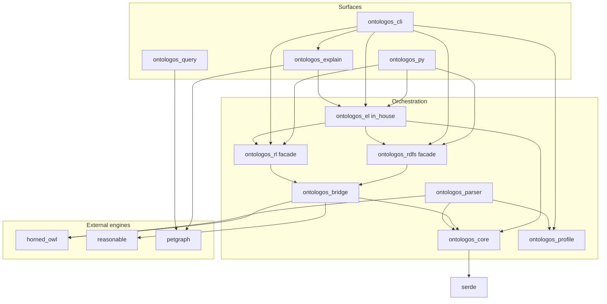
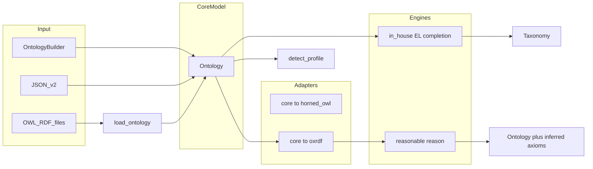

# Architecture Overview

OntoLogos is a dependency-first orchestration workspace: unified embed API, profile detection, CLI, Python bindings, and conformance harnesses built on maintained Rust OWL crates. See [dependency-first ADR](internal/design/dependency-first.md).

## Crate dependency graph

Published to crates.io: `ontologos-core`, `ontologos-parser`, `ontologos-profile`, `ontologos-bridge`, `ontologos-rdfs`, `ontologos-rl`, `ontologos-el`, `ontologos-query`, `ontologos-explain`.

Workspace-only: `ontologos-cli`, `ontologos-conformance`, `ontologos-py`.

## Data flow

1. **Construct or load** an `Ontology` (builder, JSON, or parser).
2. **Optionally detect profile** with `ontologos_profile::detect_profile`.
3. **Run a facade** — EL returns `Taxonomy` via in-house completion in `ontologos-el`; RL/RDFS materialize via reasonable into the same `Ontology`.
4. **Query** via `ontologos-query` (petgraph-backed hierarchy views).

## Core model (`ontologos-core`)

Single embed-facing representation:

| Component | Role |
|-----------|------|
| `InternPool` | Deduplicated IRI strings |
| `EntityRegistry` | Typed entities (class, individual, properties) |
| `AxiomStore` | Structured TBox and ABox axioms |
| `AxiomIndex` | Secondary indexes for traversal |
| `ParseMeta` | Parser scan metadata (optional) |
| `Taxonomy` | EL classification output |

Serialization: JSON snapshot v2 (`to_json` / `from_json`).

**Deliberate split:** `Ontology::from_file` returns `ParseNotAvailable`. File loading lives in `ontologos-parser`.

## Bridge (`ontologos-bridge`)

Owns conversions between models for parsing and RL/RDFS adapters:

| Module | Direction |
|--------|-----------|
| `horned` | `Ontology` ↔ horned-owl `SetOntology` |
| `triples` | `Ontology` ↔ oxrdf triples for reasonable |
| `taxonomy` | Transitive reduction via petgraph |

## Engine facades

| Profile | Facade crate | Implementation |
|---------|--------------|----------------|
| RDFS | `ontologos-rdfs` | `reasonable` (RDFS rules subset of RL) |
| OWL RL | `ontologos-rl` | `reasonable` |
| OWL EL | `ontologos-el` | In-house ELK-style completion |
| Query | `ontologos-query` | petgraph over `Taxonomy` |
| Explain | `ontologos-explain` | petgraph proof graphs; EL inference traces |

## Reasoner facade

`Reasoner` in core is a configuration wrapper. Use profile crates for actual work:

| `Profile` | Use |
|-----------|-----|
| `Auto` | `ontologos_el::classify_with_profile` |
| `El` | `ontologos_el::ElClassifier` |
| `Rdfs` | `ontologos_rdfs::materialize_reasoner` |
| `Rl` | `ontologos_rl::classify_reasoner` |

## CLI surface

- `profile` — detect OWL profile
- `classify --profile auto|el|rl|rdfs` — routed classification
- `materialize` — RDFS materialization via reasonable
- `explain` — proof graphs (EL-first for RL)

## Design choices

| Choice | Rationale |
|--------|-----------|
| Delegate RL/RDFS, own EL | reasonable is maintained for RL/RDFS; EL uses in-house completion (v0.6.1 restored after whelk git dependency blocked publish) |
| Stable facade crate names | Semver and docs.rs URLs unchanged |
| Core stays embed boundary | No re-export of horned-owl/reasonable types |
| petgraph for views only | Not a second completion engine |
| Adapter fidelity gates | HermiT Tier A + Pizza EL golden + Family RL reasonable closure in CI |

## Related

- [Choosing an API](guides/choosing-an-api.md)
- [Supported constructs](reference/supported-constructs.md)
- [Comparison with other tools](comparison.md)
- [SPEC.md](project/spec.md)
