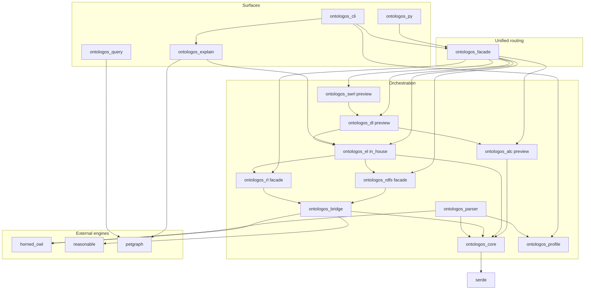
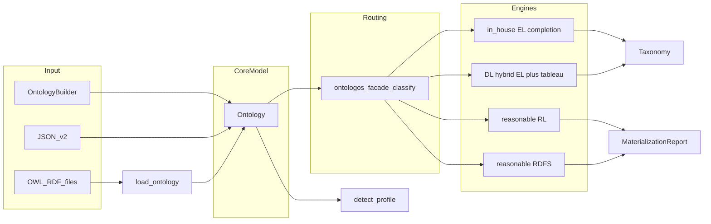

# Architecture Overview

OntoLogos is a dependency-first orchestration workspace: unified embed API, profile detection, CLI, Python bindings, and conformance harnesses built on maintained Rust OWL crates. See [dependency-first ADR](internal/design/dependency-first.md).

## Crate dependency graph

Published to crates.io (15 crates): `ontologos-core`, `ontologos-profile`, `ontologos-parser`, `ontologos-bridge`, `ontologos-rdfs`, `ontologos-rl`, `ontologos-el`, `ontologos-abox`, `ontologos-alc`, `ontologos-dl`, `ontologos-swrl`, `ontologos-query`, `ontologos-explain`, `ontologos-ql`, `ontologos-facade`.

Workspace-only: `ontologos-cli`, `ontologos-conformance`, `ontologos-py`, `ontologos-watch`.

## Data flow

1. **Construct or load** an `Ontology` (builder, JSON, or parser).
2. **Optionally detect profile** with `ontologos_profile::detect_profile`.
3. **Route via facade** — `ontologos_facade::classify` dispatches to EL, RL/RDFS, DL, ALC, or SWRL engines.
4. **Query** via `ontologos-query` (petgraph-backed hierarchy views).

## Core model (`ontologos-core`)

Single embed-facing representation:

| Component | Role |
|-----------|------|
| `InternPool` | Deduplicated IRI strings |
| `EntityRegistry` | Typed entities (class, individual, properties) |
| `AxiomStore` | Structured TBox and ABox axioms |
| `AxiomIndex` | Secondary indexes for traversal |
| `ParseMeta` | Parser scan metadata (optional) |
| `Taxonomy` | EL/DL classification output |

Serialization: JSON snapshot v2 (`to_json` / `from_json`).

**Deliberate split:** `Ontology::from_file` returns `ParseNotAvailable`. File loading lives in `ontologos-parser`.

## Bridge (`ontologos-bridge`)

Owns conversions between models for parsing and RL/RDFS adapters:

| Module | Direction |
|--------|-----------|
| `horned` | `Ontology` ↔ horned-owl `SetOntology` |
| `triples` | `Ontology` ↔ oxrdf triples for reasonable |
| `taxonomy` | Transitive reduction via petgraph |

## Engine facades

| Profile | Facade crate | Implementation |
|---------|--------------|----------------|
| RDFS | `ontologos-rdfs` | `reasonable` (RDFS rules subset of RL) |
| OWL RL | `ontologos-rl` | `reasonable` |
| OWL EL | `ontologos-el` | In-house ELK-style completion |
| ALC | `ontologos-alc` | Tableau-lite (preview) |
| DL | `ontologos-dl` | Hybrid EL + saturation + tableau (preview) |
| SWRL | `ontologos-swrl` | Preview stub |
| Query | `ontologos-query` | petgraph over `Taxonomy` |
| Explain | `ontologos-explain` | petgraph proof graphs; EL inference traces |

## Unified facade (`ontologos-facade`)

CLI and Python call **`ontologos_facade::classify`**. Prefer it in Rust when using `Profile::Auto`, `Dl`, `Alc`, or `Swrl`.

Routing uses a two-layer design (DIP):

1. **`ontologos_profile::resolve_route`** — maps `Profile` + ontology to [`ResolvedRoute`](https://docs.rs/ontologos-core/latest/ontologos_core/struct.ResolvedRoute.html) (`EngineKind`, capabilities) without depending on engine crates.
2. **`EngineRegistry`** (facade-internal) — dispatches to profile adapters (`ElAdapter`, `RlAdapter`, `DlAdapter`, …) implementing narrow traits (`ClassifyEngine`, `ConsistencyEngine`, `RoleQueryEngine`).

| `Profile` | Routed to |
|-----------|-----------|
| `Auto` | Detected EL/RL; **DL** if profile detection returns DL; **Hybrid** for multi-module DL ontologies |
| `El`, `Rdfs`, `Rl` | Respective engine adapter |
| `Alc` | `ontologos-alc` |
| `Dl` | `ontologos-dl` |
| `Swrl` | `ontologos-swrl` (preview) |

`ClassifyOutcome` is re-exported from the facade (`ontologos_facade::ClassifyOutcome`).

See [Facade API](guides/facade-api.md), [Preview profiles](guides/preview-profiles.md), and [API stability ADR](internal/design/api-stability.md).

**Do not** call `ontologos_core::Reasoner::classify()` — removed in 1.0.0; use the facade or profile crates.

## CLI surface

- `profile` — detect OWL profile
- `classify --profile auto|el|rl|rdfs|alc|dl|dl-preview|swrl` — routed classification
- `materialize` — RDFS materialization via reasonable
- `explain` — proof graphs (EL full; RL/RDFS asserted-only)

## Design choices

| Choice | Rationale |
|--------|-----------|
| Delegate RL/RDFS, own EL | reasonable is maintained for RL/RDFS; EL uses in-house completion |
| Unified facade crate | Breaks EL↔DL cycles; single entry for CLI/Python |
| Stable facade crate names | Semver and docs.rs URLs unchanged |
| Core stays embed boundary | No re-export of horned-owl/reasonable types |
| petgraph for views only | Not a second completion engine |
| Adapter fidelity gates | HermiT Tier A + Pizza EL golden + Family RL reasonable closure in CI |

## Related

- [Facade API](guides/facade-api.md)
- [Choosing an API](guides/choosing-an-api.md)
- [Supported constructs](reference/supported-constructs.md)
- [Comparison with other tools](comparison.md)
- [SPEC.md](project/spec.md)
