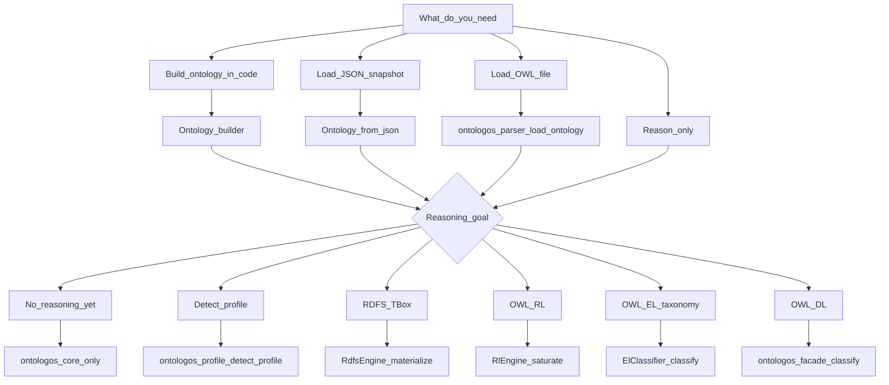

# Choosing an API

OntoLogos exposes multiple entry points. This guide picks the right crate and function for your workflow.

## Decision tree



## By task

### Programmatic ontology construction

**Crate:** `ontologos-core` only

```rust
use ontologos_core::Ontology;

let ontology = Ontology::builder()
    .class("http://example.org/A")?
    .subclass_of("http://example.org/A", "http://example.org/B")?
    .build()?;
```

See [First ontology](../getting-started/first-ontology.md).

### JSON snapshot round-trip

**Crate:** `ontologos-core` only

```rust
let json = ontology.to_json()?;
let restored = Ontology::from_json(&json)?;
```

See [JSON snapshot v3](../json-snapshot-v3.md) (v2 legacy: [v2](../json-snapshot-v2.md)). Use `from_json_with_limits` for untrusted input.

### Load OWL/RDF files

**Crates:** `ontologos-parser` (+ `ontologos-core`)

```rust
use ontologos_parser::load_ontology;

let ontology = load_ontology(path)?;
```

Do **not** use `Ontology::from_file` — it returns `ParseNotAvailable` by design.

See [Load an OWL file](../getting-started/load-owl-file.md).

### Profile detection

**Crates:** `ontologos-parser`, `ontologos-profile`

```rust
use ontologos_parser::load_ontology;
use ontologos_profile::detect_profile;

let ontology = load_ontology(path)?;
let report = detect_profile(&ontology)?;
```

Or CLI: `ontologos profile file.owl`

### RDFS TBox materialization

**Crates:** `ontologos-rl` (+ parser if loading files). RDFS lives in `ontologos_rl::rdfs` (workspace **1.0.0**). Published **0.9.0** also ships standalone `ontologos-rdfs` — see [v0.9.x → v1.0.0](../migration/v0.9.x-to-v1.0.0.md).

**Direct:**

```rust
use ontologos_rl::rdfs::RdfsEngine;

let report = RdfsEngine::new().materialize(&mut ontology)?;
```

**Via reasoner facade:**

```rust
use ontologos_core::{Profile, Reasoner};
use ontologos_rl::rdfs::classify_reasoner;

let mut reasoner = Reasoner::builder().profile(Profile::Rdfs).build(ontology)?;
classify_reasoner(&mut reasoner)?;
```

CLI: `ontologos materialize` (RDFS) or `ontologos classify --profile rdfs|rl|el|auto|dl|dl-preview|alc|swrl`.

See [RDFS materialization](../getting-started/rdfs-materialization.md).

### OWL RL saturation

**Crates:** `ontologos-rl` (+ parser if loading files)

**Direct:**

```rust
use ontologos_rl::RlEngine;

let report = RlEngine::new(1).saturate(&mut ontology)?;
```

**Via reasoner facade:**

```rust
use ontologos_core::{Profile, Reasoner};
use ontologos_rl::classify_reasoner;

let mut reasoner = Reasoner::builder().profile(Profile::Rl).build(ontology)?;
classify_reasoner(&mut reasoner)?;
```

Do **not** call `Reasoner::classify()` on core for RL — it returns a delegate hint.

CLI: `ontologos classify --profile rl`. Python: `Reasoner(path="file.owl", profile="rl").classify()`.

See [OWL RL saturation](../getting-started/owl-rl-saturation.md).

### OWL EL taxonomy classification

**Crates:** `ontologos-el`, `ontologos-ql` (+ parser if loading files)

```rust
use ontologos_el::ElClassifier;

let taxonomy = ElClassifier::new().classify(&ontology)?;
```

**Routed classification (multi-profile, including DL):**

```rust
use ontologos_facade;

let outcome = ontologos_facade::classify(&mut reasoner)?;
```

For EL-only routing without DL: `ontologos_el::classify_reasoner` or `ElClassifier::classify`.

CLI: `ontologos classify --profile el`. Python: `Reasoner(path="file.owl", profile="el").classify()`.

See [OWL EL classification](../getting-started/owl-el-classification.md).

### Python

**Package:** `pip install ontologos` (v0.9.0)

```python
from ontologos import Reasoner

Reasoner(path="file.owl", profile="rdfs").classify()
Reasoner(path="file.owl", profile="rl").classify()
Reasoner(path="file.owl", profile="el").classify()
Reasoner(path="file.owl", profile="auto").classify()
Reasoner(path="file.owl", profile="dl-preview").classify()  # preview
```

See [Python guide](python.md) and [Preview profiles](preview-profiles.md).

## Dependency cheat sheet

| Workflow | Minimum dependencies |
|----------|---------------------|
| Builder / JSON only | `ontologos-core` |
| Load OWL files | `ontologos-core`, `ontologos-parser` |
| + Profile detection | `+ ontologos-profile` |
| + RDFS | `+ ontologos-rl` (`ontologos_rl::rdfs`) |
| + OWL RL | `+ ontologos-rl` |
| + OWL EL + queries | `+ ontologos-el`, `+ ontologos-ql` |
| + Multi-profile / DL preview | `+ ontologos-facade` (pulls el, dl, alc, swrl) |

There is no single `ontologos` meta-crate on crates.io.

## Common mistakes

| Mistake | Fix |
|---------|-----|
| `Ontology::from_file` | Use `ontologos_parser::load_ontology` |
| `Reasoner::classify()` for RL/RDFS/EL/DL | Use `ontologos_facade::classify` or profile crate helpers |
| Expect CLI `classify` to match HermiT DL | Preview only — see [Preview profiles](preview-profiles.md) |
| Compare axiom count to Protégé | See [supported constructs](../reference/supported-constructs.md) |
| `Profile::Auto` on core reasoner | Use `ontologos_facade::classify`, CLI `classify --profile auto`, or Python `profile="auto"` |

## Related

- [Facade API](facade-api.md)
- [Preview profiles](preview-profiles.md)
- [Architecture](../architecture.md)
- [Error reference](../reference/errors.md)
- [FAQ](../project/faq.md)
