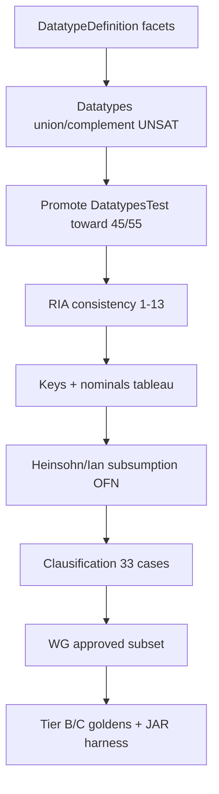

# HermiT parity gap report

**Baseline commit:** `410a06c` (2026-06-13) · **Updated:** 2026-06-14  
**Target release:** **1.0** — functional HermiT replacement ([ROADMAP.md](../../ROADMAP.md) §1.0)  
**Current metrics:** **177** active CI tests · **105** axiom cases · **34** planned DL failures  
**Triage commands:**

```bash
bash benchmarks/scripts/parity-scan.sh          # all three scans, release + parallel
cargo run --release -p ontologos-conformance --bin dl_failures
cargo run --release -p ontologos-conformance --bin promote_catalog
bash benchmarks/scripts/promote-hermit-catalog.sh
cargo test -p ontologos-conformance --test hermit_generated
cargo test -p ontologos-dl --test datatype_consistency
cargo test -p ontologos-conformance --test dl_subsumption_cases
```

---

## Executive summary

OntoLogos has cataloged **594** HermiT Java test methods and runs **59** of them as active CI conformance checks today. The remaining work for **1.0 parity** is not a single engine fix — it spans datatype semantics, DL tableau/RIA consistency, structural clausification, OWL WG entailment, Tier B/C goldens, and API surface.

| Layer | Status |
|-------|--------|
| **Tier A** (hand-written RL/RDFS/EL) | Green in CI |
| **Semantic DL axiom fixtures** | **105** promoted; **34** planned failures |
| **Clausification (structural)** | **33** cases — not started |
| **OWL WG entailment** | **428** cases — all `planned` |
| **Tier B/C** (goldens, JAR/Konclude, corpora) | Not gated in CI yet |

**Largest semantic gaps:** ReasonerTest consistency (**42** failures, mostly RIA + keys/nominals), DatatypesTest consistency (**23** failures, facets/unions/mixed numerics).

---

## Conformance harness snapshot

### Catalog (`benchmarks/data/hermit/catalog/cases.json`)

| Status | Count | Meaning |
|--------|------:|---------|
| `planned` | 432 | OFN/fixture present; engine not yet passing |
| `axiom` | 50 | Active semantic checks (`run_hermit_case`) |
| `wg` | 3 | OWL WG entailment (vendored RDF) |
| `clausify` | 33 | Structural DL clausification regression |
| `ported` | 15 | Hand-written in `hermit_rl` / `hermit_rdfs` / `hermit_el` |
| `internal` | 55 | Parser/normalization smoke |
| `excluded` | 4 | Documented out-of-scope |
| `fixture` | 2 | Resource XML goldens |
| `migrated` | 3 | Moved to another suite |
| `swrl` | 1 | SWRL engine |
| **Total** | **594** | |

### CI execution (`hermit_generated.rs`)

| Metric | Value |
|--------|------:|
| Tests defined | 594 (+428 WG) |
| **Passing (active)** | **125** |
| Ignored (`planned` / deferred) | **941** |
| Failing | 0 |

### Planned DL failures (`dl_failures` bin)

| Family | Failures |
|--------|----------:|
| `ReasonerTest` | 42 |
| `DatatypesTest` | 23 |
| `RIATest` | 1 |
| `ReasonerCoreBlockingTest` | 1 |
| **Total** | **67** |

Promoted axiom IDs on disk: **16** (`promoted_axiom_ids.txt`). Catalog shows **26** `axiom` entries — promotion list and catalog regen can drift; re-run `promote-hermit-catalog.sh` after engine increments.

---

## Active semantic cases (26)

These are the only catalog entries with `status=axiom` today:

| Case | Engine | Assertion kind |
|------|--------|----------------|
| `testDatatypeDef1/4/6` | dl | consistency |
| `testDatatypesSat` | dl | consistency |
| `testDateTime1` | dl | consistency |
| `testDifferentLexicalForms` | dl | consistency |
| `testGetDataPropertyValues` | dl | consistency |
| `testExpansion` | dl | consistency |
| `testChanges` | dl | consistency |
| `testDateTime2` | dl | consistency |
| `testExistsSelf2` | dl | consistency |
| `testHasKeysOnlyNamed` | dl | consistency |
| `testKeys2` | dl | consistency |
| `testLearningBacktracking` | dl | consistency |
| `testNonUnaryKeys2` | dl | consistency |
| `testHeinsohnTBox3` | dl | subsumption (4 pairs) |
| `testIanFact2` | dl | subsumption |
| `testIanQNRTest` | dl | subsumption |
| `testSatisfiabilityWithRIAs14` | dl | subsumption |
| `testUniversalRoleSubsumption` | dl | subsumption |
| `testBottomObjectPropertyAssertion` | rdfs | consistency |
| `testIsInverseFunctionalObject` | rdfs | property char |
| `testIsIrreflexiveObject` | rdfs | property char |
| `testIsReflexiveObject` | rdfs | property char |
| `testSubRolesChain` | rdfs | property subsumption |
| `testSameAsInBody2` | swrl | consistency |

---

## Gap family A — DatatypesTest (semantic)

**Catalog:** 55 semantic candidates (consistency via `assertABoxSatisfiable`); **6** promoted, **49** planned.  
**Failures:** **23** (`dl_failures`).  
**Pass rate:** ~11% active / ~45% if counting engine-passing-but-unpromoted.

### Failure taxonomy

| Kind | Count | Cases |
|------|------:|-------|
| **False positive** (we report SAT; HermiT UNSAT) | 15 | `testAllValuesFromDifferentTypes2`, `testDatatypeDef2/3/5`, `testDatatypeUnionIntersection2/3`, `testDatatypesUnsat2/3`, `testDateTime2`, `testDecimalPlusInteger`, `testFloatEnumInconsistent`, `testNotXsdString`, `testRationals2`, `testSelfInequality`, `testdateTimeTimezones` |
| **False negative** (we report UNSAT; HermiT SAT) | 8 | `testAllValuesFromMixed1`, `testDatatypeUnion3`, `testDatatypeUnionIntersection1`, `testDecimals`, `testDisjointDPsSatInteger`, `testIntPlusDecimal`, `testNegZero2Integer`, `testNominalsAndDatatypesFromAlan` |

### Root causes (engine)

| Area | Symptom | Primary files |
|------|---------|---------------|
| **DatatypeDefinition facets** | `testDatatypeDef2/3/5` false positives | `ontologos-dl/src/datatype/mod.rs`, `consistency.rs`; parser `map_dl.rs` |
| **Complement / union / intersection** | `testNotXsdString`, `testDatatypeUnionIntersection*` | `DataExpr::Not`, `facet_check`, witness generation |
| **Mixed XSD numerics** | `testDecimals`, `testIntPlusDecimal`, `testNegZero2Integer` | `literal_in_datatype_value_space`, canonical keys |
| **DateTime / timezone** | `testDateTime2`, `testdateTimeTimezones` | datetime value-space in `datatype/mod.rs` |
| **Float specials** | `testFloatEnumInconsistent` | INF/NaN handling |
| **ABox + nominals** | `testNominalsAndDatatypesFromAlan` | class + datatype interaction in `consistency.rs` |

### Structural sibling (not in `dl_failures`)

**32** `ClausificationDatatypesTest` cases (`status=clausify`) — validates clausifier output, not ABox consistency. Tracked separately in §Gap family D.

### Exit target (from parity plan)

≥ **45/55 (82%)** DatatypesTest semantic pass rate; all engine-passing cases in `promoted_axiom_ids.txt`.

---

## Gap family B — ReasonerTest (semantic)

**Catalog:** 87 semantic candidates; **18** `axiom`, **64** planned, **11** `ported` (RL).  
**Failures:** **42** consistency (+ subsumption cases counted in planned bucket).

### B1 — RIA consistency mega-bucket (14 failures)

All `testSatisfiabilityWithRIAs1`–`13` (+ `11b`): complex role chains, transitivity, and tableau blocking. **RIA14 subsumption is done** (`testSatisfiabilityWithRIAs14` promoted); consistency siblings remain.

| Work | Files |
|------|-------|
| Role chain saturation beyond single-hop | `ontologos-dl/src/ria.rs`, `saturation.rs` |
| Top/object-property universal semantics | `ontologos-alc/src/tableau/expand.rs`, `normalize.rs` |
| Blocking / unraveling | `ontologos-alc/src/tableau/block.rs` |

### B2 — Other ReasonerTest consistency (28 failures)

| Theme | Examples |
|-------|----------|
| **Keys** | `testKeys`, `testKeys1`, `testKeysNegatedClass`, `testNonUnaryKeys` |
| **Nominals / anonymous** | `testAnonymousIndiviuals1`, `testNIRuleBlockingWithUnraveling` |
| **Incremental negation** | `testIncrementalWithNegatedClass/HasSelf/HasValue` |
| **Satisfiability smoke** | `testSatisfiability1`–`4` |
| **Datatypes in TBox** | `testUnknownDatatypes`, `testDataRanges`, `testDateTime` |
| **Role algebra** | `testChains4`, `testRoleChainsWithTransitiveSymmetric`, `testRoleDisjointness2` |
| **Misc DL** | `testWidmann1/3`, `testUniversalRolePartitionedABox`, `testReflexivity`, `testExistsSelf1` |

### B3 — Subsumption OFN (catalog + engine)

| Case | Status | Notes |
|------|--------|-------|
| `testHeinsohnTBox3` | **axiom** | 4/4 subsumptions pass (cardinality derive + tableau) |
| `testSatisfiabilityWithRIAs14` | **axiom** | Top-role catalog helper |
| `testIanFact2`, `testIanQNRTest` | **axiom** | Promoted |
| `testUniversalRoleSubsumption` | **axiom** | Promoted |
| `testSubsumption2/3` | RL (`FORCE_RL_ENGINE_IDS`) | Pass via RL, not DL |
| `testClassificationSubClassBug` | planned | Flower ontology; tableau cardinality incomplete |
| `testDependencyDisjunctionMergingBug` | planned | Needs `res/wine.xml` parser support |
| `testIanFact4`, Heinsohn 4a/b/7, etc. | planned | **~50** ReasonerTest OFN files vendored; extraction/subsumption pending |

**Catalog work:** generalize `extract_axioms_assignments`, filter bogus OWL API CE captures, hand-vendor atomic subsumption conclusions for API-built tests (`generate_catalog.py`).

### B4 — RIATest + blocking (2 failures)

| Case | Issue |
|------|-------|
| `RIATest` (1) | Role inverse axiom semantics |
| `ReasonerCoreBlockingTest` (1) | Tableau blocking edge case |

---

## Gap family C — OWL WG entailment

| Metric | Value |
|--------|------:|
| `wg_cases.json` entries | 428 |
| `status=wg` (approved, runnable) | **0** |
| Premise/conclusion OFN on disk | Subset vendored under `benchmarks/data/hermit/wg/` |

**Gate:** Roadmap requires approved OWL WG DL entailment subset passing via `ontologos-dl` two-ontology entailment (`catalog.rs` `WgCase`).

**Work:** Curate `WG_APPROVED_SUBSET` in `generate_catalog.py`, promote cases as `status=wg`, implement batch entailment runner in CI.

---

## Gap family D — Structural / internal

| Suite | Count | Status | 1.0 requirement |
|-------|------:|--------|-----------------|
| `ClausificationDatatypesTest` | 32 | `clausify` | DL internal regression |
| `ClausificationTest` | 1 | `clausify` | DL internal regression |
| Normalization / internal | 55 | `internal` | Parser smoke |
| `EntailmentTest` | 10 | `planned` | Complex CE entailment API |
| `RulesTest` (SWRL) | 23 planned | SWRL engine | Out of 1.0 scope per roadmap |
| `ClassificationTest` | 4 | fixture/ported | Tier B goldens (wine, galen) |

---

## Gap family E — 1.0 platform (non-harness)

From [ROADMAP.md](../../ROADMAP.md) §1.0 — not measured by `dl_failures`:

| Area | Status |
|------|--------|
| `classify --profile dl` stable (no preview warning) | Preview flag still exists |
| DL explanations at EL quality bar | Partial |
| OWLReasoner-equivalent API (realize, full entailment) | Incomplete |
| Python DL classify/explain/query parity | Partial (`ontologos-py`) |
| HermiT JAR + Konclude reference harness | Not in CI |
| DL corpora taxonomy tolerance (Pizza-DL, Galen, OBO) | Not gated |
| Performance targets (medium DL < 30s) | Not benchmarked |
| Parity scan tooling | Release build + parallel case scan (`parity-scan.sh`); `infer_named_subsumptions` still O(n²) on large ontologies |

---

## Recommended priority (next increments)



### Sprint-sized increments

1. **DatatypeDefinition → `LiteralIndex`** — fixes 3+ UNSAT false positives (`testDatatypeDef2/3/5`).
2. **Complement + union/intersection** — fixes `testNotXsdString`, `testDatatypeUnionIntersection*`.
3. **Mixed numeric value-space** — fixes false negatives (`testDecimals`, `testIntPlusDecimal`, …).
4. **Promote loop** — expect +8–12 DatatypesTest axiom promotions per cluster.
5. **RIA tableau milestone** — 14 consistency cases; unblocks largest ReasonerTest bucket.
6. **Keys / `HasKey` clausification in tableau** — `testKeys*`, `testNonUnaryKeys`.
7. **Catalog OFN expansion** — promote Ian/Heinsohn planned `.ofn` files as subsumptions pass.
8. **Clausification suite** — 33 structural tests independent of semantic pass rate.
9. **WG subset** — pick ~20–50 approved entailments; grow toward full gate.

---

## Recently closed (since `946168e`)

Documented for regression awareness:

- `DataExpr::Not` + faithful `DataComplementOf` mapping
- ABox data assertions, negative assertions, disjoint data properties in `is_datatype_consistent`
- XSD hierarchy, canonical numerics, datetime/float witnesses
- Tableau min/max cardinality (unqualified `owl:Thing` filler)
- Cardinality subsumption derivation (`ontologos-dl/src/cardinality.rs`)
- Role equivalence → saturation; existential propagation along role hierarchy
- Catalog: generalized axiom extraction, `FORCE_RL_ENGINE_IDS`, bogus CE filter
- Promoted: `testHeinsohnTBox3`, `testIanFact2`, `testIanQNRTest`, `testSatisfiabilityWithRIAs14`, DatatypesTest quick wins

---

## References

| Doc | Purpose |
|-----|---------|
| [ROADMAP.md](../../ROADMAP.md) §1.0 | Release gate checklist |
| [hermit-replacement.md](research/hermit-replacement.md) | Tier A/B/C matrix |
| [upstream-reasonable-gaps.md](upstream-reasonable-gaps.md) | RL adapter gaps (separate from DL) |
| [tests/hermit/generate_catalog.py](../../tests/hermit/generate_catalog.py) | Catalog generator |
| [benchmarks/scripts/promote-hermit-catalog.sh](../../benchmarks/scripts/promote-hermit-catalog.sh) | Promotion workflow |

---

*Regenerate metrics after major engine work:*

```bash
python3 tests/hermit/generate_catalog.py
cargo run --release -p ontologos-conformance --bin dl_failures 2>&1 | head -3
cargo test -p ontologos-conformance --test hermit_generated 2>&1 | tail -1
```
