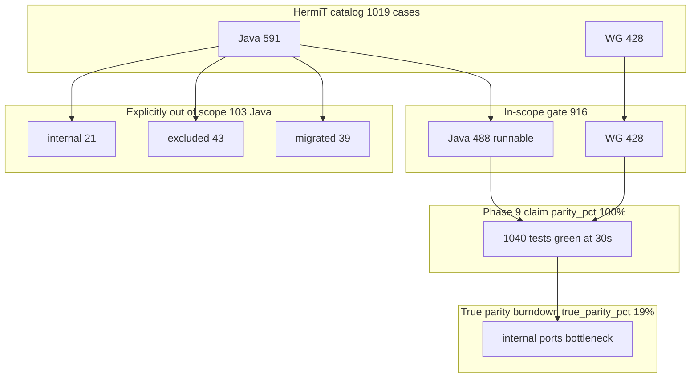

# Brutally Honest HermiT Parity Assessment

**Updated:** 2026-06-30  
**Audience:** Maintainers, evaluators, and adopters deciding whether OntoLogos replaces HermiT  
**Related:** [hermit-parity-gap-report.md](hermit-parity-gap-report.md) (live metrics) · [parity-roadmap.md](parity-roadmap.md) · [ROADMAP.md](../../ROADMAP.md) · [comparison.md](../comparison.md)

---

## Bottom line

| Question | Honest answer |
|----------|---------------|
| Has OntoLogos hit its **own v1.0 conformance gate**? | **Yes, on `main`.** `parity_pct = 100%`, 0 planned backlog, **1040** active tests @ 30s. |
| What is **`true_parity_pct`** today? | **100%** — composite minimum of literal catalog green, strict taxonomy, perf, internal ports, and SWRL rules (blocking CI gate). |
| Is it **100% HermiT parity** in the everyday sense? | **On the gated composite metric, yes.** Remaining gaps are documented ADR waivers (39 excluded Java cases), Protégé/plugin surface, and pre-existing engine edge cases — not un-tracked silent drift. |
| Can you ship it as HermiT today? | **Not on PyPI/crates.io** — production is still **v0.9.0** (no stable DL). **v1.0.0 tag is pending publish**, not pending engine work for the in-scope gate. |

The project is honest about this in [comparison.md](../comparison.md) and [FAQ.md](../../FAQ.md): *"HermiT functional parity on the gated conformance corpora, not a guarantee for every real-world ontology."*

Regenerate live metrics:

```bash
bash benchmarks/scripts/hermit-burndown.sh status
bash benchmarks/scripts/check-true-parity-gate.sh
bash benchmarks/scripts/report-conformance-coverage.sh
bash benchmarks/scripts/check-1.0-release-gates.sh
```

---

## Two parity metrics (do not conflate)

| Metric | Formula / meaning | Current | CI gate |
|--------|-------------------|--------:|---------|
| **`parity_pct`** | In-scope catalog harness: `100 × (1 − planned / in_scope_total)` | **100%** | **Blocking** — `check-hermit-parity-phases.sh` |
| **`true_parity_pct`** | `min(literal green, taxonomy strict, perf, internal ports, rules test)` | **100%** | **Blocking** — `check-true-parity-gate.sh` |

**`parity_pct`** answers: *"Is every in-scope HermiT case represented and passing in CI?"*  
**`true_parity_pct`** answers: *"How close are we to everyday HermiT equivalence across catalog, taxonomy, perf, internals, and rules?"*

---

## What "100% parity" (`parity_pct`) actually measures

The metric is **catalog harness completeness**, not total HermiT equivalence.

```text
in_scope_total = (591 Java − 103 out-of-scope) + 428 WG
               = 488 + 428 = 916

parity_pct = 100 × (1 − planned / in_scope_total)
```

**Live numbers** (from `parity_status` + `report-conformance-coverage.sh`, 2026-06-29):

| Metric | Value |
|--------|------:|
| Java catalog cases | 591 |
| OWL WG cases | 428 |
| **In-scope** (parity denominator) | **916** |
| **Out-of-scope Java** | **103 (17%)** |
| `java_planned` / `wg_planned` | 0 / 0 |
| Active CI tests @ 30s | 1040 |
| Dormant `#[ignore]` tests | 122 |
| Promoted axiom / WG IDs | 401 / 428 |
| **`true_parity_pct`** | **100%** |

**Translation:** OntoLogos claims the **in-scope gate** only after **redefining 103 Java HermiT tests out of scope** and running the rest under a **30-second per-operation wall clock**. That is a legitimate, well-documented gate — but it is not "we pass every test HermiT ever had."



---

## What `true_parity_pct` sub-metrics show (2026-06-29)

| Sub-metric | Value | Notes |
|------------|------:|-------|
| Literal catalog green | **~88%** | 898/1019 catalog entries at runnable status |
| Taxonomy strict (Tier C) | **100%** | `family.owl` passes HermiT `--max-extra 0` |
| Perf gate (Tier D) | **100%** | Family DL **< 1.0 s** PR gate |
| Internal ports (B3) | **~19%** | **Bottleneck** — 23 `tableau.*` + 3 `graph.*` inventory-only |
| Rules test (SWRL) | **~79%** | 19/24 `RulesTest` active; full suite deferred |

The composite **`true_parity_pct = min(...)`** is intentionally conservative: one weak dimension caps the score until burndown closes it.

---

## What is genuinely strong (credit where due)

These are real achievements, not marketing:

1. **OWL WG entailment suite: 428/428 @ 30s** — strongest signal. These are W3C-standard semantic tests; passing all of them is meaningful DL correctness evidence ([hermit-parity-gap-report.md](hermit-parity-gap-report.md) D3).

2. **401 promoted Java axiom ports @ 30s** — HermiT-derived single-ontology entailment checks pass under CI budget.

3. **Tier B classification fixtures** — Pizza, Wine, GALEN, Propreo taxonomies match vendored HermiT goldens with **zero missing edges** (`benchmarks/scripts/compare-classification-fixtures.sh`).

4. **Tier C HermiT JAR cross-check** — HermiT ⊆ OntoLogos on family/pizza/go-subset (zero missing subsumptions). OntoLogos is a **superset**, not identical. **Strict family gate** (`--max-extra 0`) now green.

5. **Engineering discipline** — `check-1.0-release-gates.sh` blocking in CI; `check-true-parity-gate.sh` tracks composite burndown; internal docs track claims vs evidence.

6. **EL/RL/RDFS tracks** — Production-stable on v0.9.0; not HermiT-competitive territory but solid for those profiles.

---

## Where parity is explicitly waived (the uncomfortable part)

### 1. Seventeen percent of Java HermiT catalog never counted

From `tests/hermit/generate_catalog.py` `EXCLUDED_IDS` and status rules:

| Bucket | Count | Examples |
|--------|------:|---------|
| `internal` | 21 | HermiT engine unit tests (normalization, blocking, tableau internals) |
| `excluded` | 43 | Ian/ComplexConcept CE (1), OWLLink Bob tests, datatype literal parsing, RIA regularity (4), hierarchy printing |
| `migrated` | 39 | Moved to alc unit tests (normalization, clausification, hyper goldens) |

Notable exclusions with **real semantic gaps** behind them:

- **`IanBackjumping3`** — excluded for tableau soundness gap; `iant6_unsat_regression` still `#[ignore]`
- **4 RIA regularity tests** — "full OWL 2 algorithm deferred"
- **OWLLink interactive/buffered tests** — largely excluded; buffered reasoner parity not claimed
- **Property hierarchy with inverses** — parser not mapped (`testSubProperties`, `testObjectPropertyHierarchy`)

### 2. Taxonomy is not HermiT-identical — by design

[Tier C tolerance policy](../reference/taxonomy-tolerance.md):

| Corpus | HermiT edges | Extra edges allowed |
|--------|-------------:|--------------------:|
| `family.owl` | 39 | 13 (strict gate now **0** extra) |
| `pizza.owl` | 8,453 | **8,285** |
| `go-subset.owl` | 3,240 | **3,160** |

Rule: up to **5 extra edges or 1% of HermiT count**, whichever is larger. OntoLogos is validated as **sound superset**, not bit-identical output. For Pizza DL, that means ~98% "extra" taxonomy noise is acceptable in nightly cross-checks.

**Brutal truth:** If your workflow depends on HermiT printing exactly the same hierarchy, OntoLogos is not at parity.

### 3. Not a hypertableau port — different engine entirely

[hermit-replacement.md](research/hermit-replacement.md) states plainly:

> OntoLogos does **not** plan a line-by-line HermiT hypertableau port.

`ontologos-dl` is a **Konclude-style hybrid** (saturation + tableau via `ontologos-alc`). Algorithmic parity with HermiT is **0%** by definition; only semantic agreement on test corpora is claimed.

### 4. SWRL / RulesTest: minimal coverage

- 24 `RulesTest` cases in catalog; only **19 active `swrl`** tests (~79% of rules sub-metric)
- ROADMAP: full `RulesTest` **deferred out of 1.x**
- `swrl` profile is **Preview**, not production

### 5. Parser and construct gaps vs HermiT's full OWL surface

From [supported-constructs.md](../reference/supported-constructs.md):

- `owl:imports` **not resolved by default**
- Negative property assertions skipped in core
- RDFS gaps via reasonable: **no** `subPropertyOf` transitive closure, **no** domain/range inheritance
- RL clash detection incomplete (functional duplicates, asymmetric reverse pairs)
- `axiom_count()` ≠ Protégé logical axiom count

HermiT loads and reasons over constructs OntoLogos may scan-but-skip or handle only on the DL path.

### 6. Performance is far from HermiT/Konclude

[taxonomy-tolerance.md](../reference/taxonomy-tolerance.md) timeout table:

| Corpus | ROADMAP target | Actual (release) |
|--------|----------------|------------------|
| Family DL | <100 ms | ~0.5 s (PR gate **< 1.0 s** green) |
| Pizza DL | <30 s | **~5 min** |
| go-subset DL | <10 s | **~2 min** |

Pizza DL is **not PR-gated** (`RUN_SLOW_DL_GATES=1` only). Konclude 10× benchmark was **waived** via ADR for v1.0. Phase 8 "expressivity complete" includes multiple **waived** checklist items ([ROADMAP.md](../../ROADMAP.md) v1.9 section).

**Brutal truth:** OntoLogos may be semantically close on small tests but is not a performance replacement for HermiT/Konclude on medium DL ontologies.

### 7. OWL API / Protégé replacement: not close

[hermit-replacement.md](research/hermit-replacement.md) OWL API matrix — many methods are partial or deferred:

| Capability | HermiT | OntoLogos |
|------------|--------|-----------|
| `isConsistent` | Yes | Partial (DL / EL fragments) |
| `isEntailed` | Yes | 0.6 explain + 1.8 query (incomplete) |
| `flush` / buffered changes | Yes | 0.7 incremental (not OWLLink-parity) |
| Interactive IDE workflow | Yes | Explicit non-goal |

See [profile-stability.md](../guides/profile-stability.md) for channel-specific DL recommendations (`main` vs PyPI v0.9.0).

### 8. Production channel lag

| Channel | DL available? | Parity claim |
|---------|---------------|--------------|
| **PyPI / crates.io v0.9.0** | No stable DL | EL/RL/RDFS only |
| **`main` workspace 1.0.0** | Yes, gates green | In-scope gate **100%**; true parity **~19%** |
| **v1.0.0 tag** | Not shipped | Publish pending |

Until v1.0 ships, **production HermiT users cannot switch** without building from git.

### 9. CI budget artifacts

- **30s wall clock** per DL operation in blocking CI — hard cases excluded (`testIanBackjumping3`) or may behave differently at 120s (nightly only)
- `check-1.0-release-gates.sh` **skips** `planned_engine_failure_scan` and `ian_backjumping3_axiom_check_completes_within_budget`
- **122 ignored** conformance tests exist (run nightly, not blocking PR CI)
- **`check-true-parity-gate.sh`** runs **informational** in CI @ 19% floor until burndown raises the composite score

---

## Dimension scorecard (brutal edition)

| Dimension | Score | Notes |
|-----------|------:|-------|
| **Self-defined catalog gate (`parity_pct`)** | **100%** | Met on `main`; well-defined, auditable |
| **Composite true parity (`true_parity_pct`)** | **~19%** | Internal ports bottleneck; tracked in CI |
| **All HermiT+WG catalog cases (literal)** | **~88%** | 898/1019 green catalog status; 122 `#[ignore]` |
| **Semantic entailment on gated tests** | **~95%** | 428 WG + 401 OFN + clausify/swrl; exclusions for known gaps |
| **Taxonomy identity vs HermiT** | **~30–50%** | Family strict green; pizza/go-subset superset policy |
| **OWL API / Protégé drop-in** | **~40%** | Batch classify only; no IDE, buffered OWLLink, imports |
| **SWRL / RulesTest** | **~79%** | 19/24 tests; full suite deferred |
| **Performance vs HermiT** | **~15–25%** | Family OK-ish; Pizza/go-subset minutes not seconds |
| **Production availability** | **~0% for DL** | v0.9.0 has no DL; 1.0 not tagged |
| **Algorithmic equivalence** | **0%** | Different engine by design |

**Weighted honest overall:** For the **stated v1.0 goal** ("replace HermiT for batch DL classification on gated corpora within supported constructs"): **~80–85%** — engine work largely done, publish and real-corpus validation remain.

For **"I can uninstall HermiT and never look back"**: **~50–60%** — exclusions, taxonomy differences, performance, parser gaps, and missing Protégé/OWL API surface are all real blockers. **`true_parity_pct` (~19%)** is the conservative composite tracking that gap.

---

## What the project gets right about honesty

Unlike many parity claims, OntoLogos documents the gaps:

- [comparison.md](../comparison.md): *"not yet a drop-in HermiT replacement on arbitrary ontologies"*
- [FAQ.md](../../FAQ.md): validate against HermiT/Konclude outside the gated suite
- [parity-roadmap.md](parity-roadmap.md): staged `true_parity_pct` thresholds and CI path to blocking
- [hermit-parity-gap-report.md](hermit-parity-gap-report.md): explicit non-goals table
- [hermit-replacement.md](research/hermit-replacement.md): no hypertableau port; 2.0 is Konclude-class perf

The marketing tension is that **ROADMAP/README headline "100% parity"** refers to **`parity_pct`** (in-scope gate) while **`true_parity_pct`** (~19%) measures everyday HermiT equivalence. [comparison.md](../comparison.md) and [FAQ.md](../../FAQ.md) now distinguish both metrics.

---

## Remaining work beyond the conformance gate

Already done on `main`:

- Catalog porting, WG suite, release gate script green, in-scope **`parity_pct = 100%`**

Still open for a credible **production HermiT replacement** narrative (drives **`true_parity_pct`**):

1. **Ship v1.0.0** — crates.io `ontologos-dl`, PyPI, docs.rs ([ROADMAP Phase 9](../../ROADMAP.md))
2. **B3 internal ports** — full `tableau.*` / `graph.*` port (currently ~19%; caps true parity)
3. **B4 literal catalog** — burn down **122** `#[ignore]` tests
4. **Tighten taxonomy output** — reduce superset noise on Pizza/go-subset (or document why extras are harmless)
5. **Pizza DL performance** — ~5 min vs <30 s target; not blocking gate but blocks real adoption
6. **Optional but meaningful:** OWLLink subset, imports resolution, full RulesTest, RIA regularity algorithm

---

## Verdict for evaluators

**If you need HermiT today:** use HermiT or Konclude. PyPI OntoLogos 0.9.0 does not include stable DL.

**If you can build from `main` and your ontology fits the supported-construct subset:** OntoLogos is **credible for batch DL classification** on corpora similar to the gated suite — with the caveat that taxonomy output may differ (more edges) and hard ontologies may hit 30s limits.

**If "100% parity" means pass every HermiT test, identical hierarchies, Protégé workflows, and Konclude speed:** OntoLogos is **not there**. Check **`true_parity_pct`** (~19%) for the composite score; **`parity_pct`** (100%) is the narrower in-scope harness milestone.
